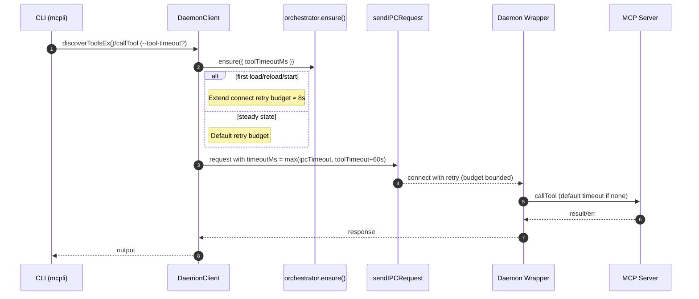
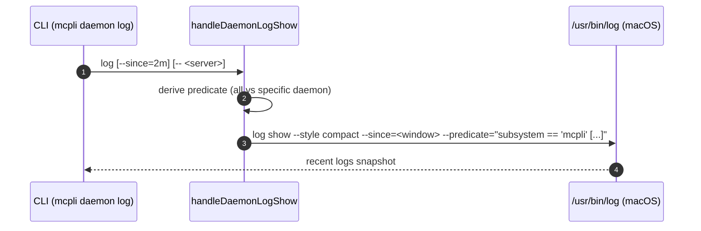

# PR #4 Review – Comments and Analysis

- Repository: cameroncooke/mcpli
- Branch: feat/tool-timeout → main
- Local counts: Issue comments: 5, Inline review comments: 8, Total: 13

## Issue Comments (General PR)

### Comment #1 — @coderabbitai[bot] (2025-09-07T20:41:22Z)

<!-- This is an auto-generated comment: summarize by coderabbit.ai -->
<!-- walkthrough_start -->

## Walkthrough
Adds configurable tool timeouts and IPC auto-buffering, adaptive connect retry budgeting, macOS daemon log snapshot command, inactivity watchdog, and related CLI/env wiring. Updates configuration, client, runtime, wrapper, IPC, and documentation. Introduces utility helpers for MCP client timeouts and comprehensive unit tests plus a timeout test server. Removes one doc.

## Changes
| Cohort / File(s) | Summary |
|---|---|
| **Documentation updates**<br>`README.md`, `docs/architecture.md`, `docs/process_architecture.md`, `docs/testing.md` | Documents new daemon log command, logging examples, timeouts overview, tool timeout env/flags, IPC auto‑buffering, adaptive connect retry, and macOS logs guidance. |
| **Cleanup removal**<br>`cleanup-analysis.md` | Deletes cleanup guidance document. |
| **Config and env vars**<br>`src/config.ts` | Adds `defaultToolTimeoutMs`, `MCPLI_TOOL_TIMEOUT_MS`; updates defaults; parses env; sets IPC default to tool timeout + buffer. |
| **Daemon client and IPC flow**<br>`src/daemon/client.ts`, `src/daemon/ipc.ts` | Adds tool timeout option and effective computation; enforces IPC ≥ tool timeout + 60s; introduces overridable connect retry budget parameter and logic. |
| **Runtime and launchd integration**<br>`src/daemon/runtime.ts`, `src/daemon/runtime-launchd.ts` | Adds `toolTimeoutMs` to ensure options; preserves prior diagnostic env; propagates tool timeout; adjusts socket activation wait. |
| **Daemon commands and logging**<br>`src/daemon/commands.ts` | Adds `toolTimeoutMs` option; implements `handleDaemonLogShow` (macOS `log show` with `--since` and server filter); updates CLI help. |
| **Wrapper behavior and observability**<br>`src/daemon/wrapper.ts` | Integrates default MCP tool timeouts; adds inactivity watchdog; enhances OSLog diagnostics; resets timers on IPC; environment-driven diag flags. |
| **MCP client utilities**<br>`src/daemon/mcp-client-utils.ts` | New helpers: compute default tool timeout, parse positive ms, and wrap `Client.callTool` with default timeout. |
| **CLI wiring**<br>`src/mcpli.ts` | Adds `--tool-timeout` and tracking of explicit `--timeout`; passes tool timeout to daemon/client; adds `log` subcommand with `--since`. |
| **Unit tests**<br>`tests/unit/*` | Adds tests for connect retry budget, IPC timeout buffering, MCP client default timeout, and timeout parsing. |
| **Example server**<br>`timeout-test-server.js` | Adds ESM server to exercise tool timeouts (`delay`/`quick` tools). |

## Sequence Diagram(s)




## Estimated code review effort
🎯 4 (Complex) | ⏱️ ~60 minutes

## Possibly related PRs
- cameroncooke/mcpli#1 — Touches the same modules (config, daemon client, commands, IPC) and likely precedes or complements these timeout/logging changes.

## Poem
> A bunny taps the clock with care, ⏱️  
> “Tool time’s snug, with buffers there!”  
> It sniffs the logs, both stream and still,  
> Then hops through sockets, patient, chill.  
> Watchdogs wake and drift to sleep—  
> With tidy timeouts, burrows keep. 🐇✨

<!-- walkthrough_end -->
<!-- internal state start -->


<!-- DwQgtGAEAqAWCWBnSTIEMB26CuAXA9mAOYCmGJATmriQCaQDG+Ats2bgFyQAOFk+AIwBWJBrngA3EsgEBPRvlqU0AgfFwA6NPEgQAfACgjoCEYDEZyAAUASpETZWaCrKPR1AGxJcAZiWpctGgkzPhY4mz4eDwU0pQS1PBhADSQBPgeafCReIipmPQYYWDwGDRUYpIkkB74RMgAFLaQZgAsAJRuCMgMsJikMXEUUshBIWFZObiIAPQ+Hmj16AwU+IjIZA6x/NzK4mHIiPiQsUTYC3zpmQxoHh7IRTVhpHz4UhQA7hTq1QCyAMJWAAyAEkAPrQEG/ACiAHkAKrQNLHJQ+NDnaYAbn4GA88hIAA9uB54Ax1LowBESFFcIw+hhSMh1BpICDaWhaLRkFcwF4pJkqTSeB5HGoGZAGgDgeDoLDYUCIVC4Yiwb8AMroDD0CA8wV4dqQD7qWCsqz/HAEMACbA+PzfcUNK6TanRADUkAAbAAGRAGgroILccRSBQYchiE4kXAudA+cqQTbYWINA29frSFkAQUgRQwJTKykqIdqREgEngJA+lAUTi1hrQyA5SloXAABswGMSdGNQlgS5AANoQRClBgkAC8ACZmABdQcQSDARDxSh6Getw3GzU7fYYW6brX4D5l+BoSBS0FgoGwgDiYLVIIAcv9odjCUhxOLWz2JiXEBvEGjfxmFKUtYmYbQMEQFkAHUqG4XY+CUa1SxLIhQPrZBYh8Uo6GRSABGqUJtiYDAyWXCVYmXXBUg+aheloOp7FwZxcBmaN4CIF5UkQWA8EYj4MHaDQ3GkT8iC4W5MmwDB1FSUoaCIKhd3yOsSEnaoaEA5BuAbZBahuO5ZGxCCMGwfcEhJIJdx6N5KDw+BaC8ew+NwASoNSJ09WmVIQTNBMKFWPh6Sc0DVMKYoFMLYNqn7RA924Xj8GmESDAAEXwBhEC4GxoUzNKYVSRispmXhMukRAwWcXofjEJMSA0ZhaHCyBitmLTxMa+hsG4ay8IIVrMscdhWuCXsnlLbBEEWEgipIFCy2Qd4BDWapCL6ct8AoVIL3Ba87wfZ9oRa2JiTQMlxRJENANiNAQPFQCSESzdcBNXN83Kc6YvsBKkpSoxH2S6QuDTBlqibKjl2QQRl2GPDABwCMqx3WaQc2StJKHuxIGUAXAICPkNAJHwRyMJkqKtTwrtAMjajGzrABrEgnsOWAttpRznKNQ8Pg2W1RBi7FQcZdBtgEc76boih6CYZhdPEAQvFS/RjHAKAyHofAfAtQhSHIZS8Jltgyi4Xh+GEfmqhkeQmCUKhVGZbQKUMEwoDgVBUEwbXiDIPYDZYI3OBONBjwcJwYzkBRbZUNRNEd5WVdMAxcvymEuo4AwACIs4MCxIEzEFvb16g8NDiCY01ul00QIwoEzTk8LPchjx/PsmMNgoWTgao0rGiZ/n9gp9I/NHj1HEUlGQeGW4mvGGneqKKhiv1agZEclDSWBqnfQCMKn3vW/qHHsVe6pk4K6F0HuY4er67lN4mw4LYmAaJ5WeBCPQGoqjAG7gJPStNT0CbA8SKBZF5VE8tkEgVoogU3oP2AAjtgSgFYlqngpCOMiDUa6QGhESAoeE0Kk2mgMYqw0yiJDCOnSAuhIA2ErFtZsG9Yp1A2GUGMPhVjMEgPDAAahWY8f4JQfC2vTZARpXoUiEVtCky1VrtDxgNPhAiH4SiutUX+d0FGAJQOwxQ2Axz0EJF2MktJCR3WJKjHwMj3qaPumBUQI0hFTQwh2Lso1xgHwwaOCc04dEJG+JgaYL0TRnlhu8SAOEPDlBEjQ2u9cjEEgsV4FmR4MJRPKBhCO4Tqz+nnmAr6VQJqRg4iQSyStWR6NoAYhuMAoE0kfpUCYN0DG4HqtQ2h7gpjIFhO8csADjELFKNyERkApqUDAGiC6pZvKMGLkQLaqCuA908bowp5ZcDyFmf6aA+AMgJgJKIPASRwj1LwC1IoWlTTmnRJaDkQgpq4ADvhagNR/DUy8mc2k7pvT2FEGELkFS65MN2fsrpLpglkIDpQjAHSoBpRIDhcgOkJmlCJjcXcyJ9mzIaKidE0TIAAEYvSQHungaQfo6xlXLBPbc5jZbOQGtRT+hKACsYAyU0GdEKcsZ4dR7I8JSL5sTaEZQYOQ4JZ4iC1DFpkPFGITxnl2hCOUCpIQwgRNAVUGo8lA2QGTWkpERyPTIvIBoy5SJckiTI3UXzhI4LwbpOBOjYhbSIJgeAAAvPCZByyrAwAHMAATTwK2qFC9gMK4V0KegsZGzD+AeHoMq9VypoAzGVX5f4ioNWIgTOw1BITP4CFWByas1EuDKrStCAAYpmeEQItUps1TtQEl5ZTymzam7VLbpRgkzZ25t55W3gn7f8WEj5HzQn+Fq3K0AbAAE0wQACF4RpRvNCLV6oe1tqVJqkVUAQRVJqcgBFvBRDF1oDMGS4yWxDt7f8HdOboD7rzpyZAZxHKYDHDiO9l59r3ifC+a1SFEX4tpCWMAXMBL2C9aBCp8JeoXtavNbAXEMIWsxSIqWGF/Tty1NlAwcTo1nTjSfBN9BkKofQuKbgsAqCYNLBIk08NdqtVPEQIoO8soShaXVWIzVQzkRINo3VVzXqvIgHIiiSUeZ3r+XDPggFbYUBmH+F9wKsKIvslg/CbiSQePGv2KaM0dHKv/YdID1i+D9ig0eUMOEzjKROfBxDNB6C62UNJEhW8kkMuBoR2hGnkO9hujC6GWtp5Ge8zohgFx4A4VRvKglEHbMhy9dUXlv69q3gA0dVKXcKJC1Rs4MNQ1oW7jAGEPE8kj3TJzAAvDVrcNhAc0mGFO4TlMiwGfVOTUQlCluJk8UNs1okA2kkPgpQN6oFoPFnwqVc6ZmiXsTr+EyNKFi84ML/AtbGLZnhGR3BsAK1JHm8Q4hpA4MBpXMG3Jjh7YoG50qx2SQMDzlYEEyHNtOYOMhmgYgHLhG6Gx20Iks4ZxronWL/gzLcDAJgW4shjVp0ztnRbBcPP63oKXZw8gK5FerulEgXg3ORPgF4EGXhMA9Xh3uPEyOmqd3vuBOyFGysjVIixXCQCaxns3lBIp0PqfcEjP048Vn42sbKiIMQPFoytPqkA1YMl6DWKTKSyCIt3k6LPLFtYGFYiG3VttjDJz04GCgHgo5301SODLrIQI0g36EUbDEfAMvaTYS+jIzhLBP6mXMpkAy9MonQLFsuCj+8Xka4YLCDUCwZIMStA2BuFAar/babEbEjl2DxYLaxeLX1kC++4WRjISv0/83qhKJQHJI6zTNkcEnpXxXlZOaka9EfkO7ApmRVBBpEALFJxLln5SLdEpZAiuv/d16Zjp0jpAXAyDDX1kyGgzBbIC9tnhTvB3XgCCb1GBvY9sCzYZFG6t5PNLHFH94ewaeZh6fgMnhg9MeoaGCQ0cvcvi4pOQBBKbB9T7dgGMbgYmMobES5FAWWfbDWPgG9bPDjLaPCCOaQEkMoe1IjeEMyLvJQHvJQU1E2VYRCXkTKEPK/CUM9ZcMoXRHgcWGaDQIQI4LAa0WkXfWgSA44bIMAx7RAbEDkcsLvAaMmKCFiO4e1KAScFkWEA/DII/HRWEPASrHwMAHuLlMVCVSNFAdfO7SML4H4K9VzbwALKAMdR8OdEEFdSER8G8LqCUGkPqDgyMO0MgONcvAzZpeXPjEgSApmJrEkDjZ5JjE4GSKkD/WYCgUIqBXkdEMiWAWgcIzA2hB9OtKtOwr/fiC9bEbCbTNwxNMnZyXjTPcGOsYPUPZPLvEkPwBgWQaHJIqANqdiMSODPrBoe6GRWbRAFYJ6L9B3RgIZDfSAScQlbWCCUnDqHSPSDCD4BAZyaEScC+f0IAugigWGMZWSWkCYrXewemeABCOgCQyAAAZhZGwJvUgDVDfiDDpnoHoWqS1CCUgEvxSS4B+EGIGlv34D4FuhRnWAvwoI+PGCkEpxhxpwR3pyQHSOXA8BUJyNiDKFPA8FSAeQwHphFnECmVwHqOsCBgRKknkH4xV0eK6O+CDC4BJL2OmCaMAjAFOEhmc14kohICUgqhOQxm0kFiiHyI/hAiUiQwGg2TEgqLwnmIvgmOxIAAkPxFlDIcBZtaRQ9so5T1AZgJRqoEAQxQgpB6AX5MpZh1SikZF0R5SZgDSpBODaRdJHsdtGAkx4T2Y/M28whDjbcw48ctZ/gqdYdo0jcHibIQYwhuiuVCkDgo0EVm9ySH8n8X839uBwjUghdYdadEcGcEiTDIAEM+oTZ6DSBGDmCJQRDAIpI3cSCyir9sT6F9CaAuAzCLCrCnxbC+sligRUjoQuoX1Mzi5Ag9TqTOo+tAT5h+YN5XlRT2TJUSI7T2A8Qdi9jdg0yiNMw08NS78tTwZT8VTQwaAyhdDPYzSw14BDcCAXARIoBfg1haR6E+RHjnjgYv5Hp6A4TXDUYGhaybBLDEQGyupUgUjV02ympUhdJX8GCmCUh78GBH9OwSQYz38fJlS2JdowB/hvhxAkFoEbB/hMwwA7jpBOIMAvzBoSoOoWiBNEywT59Uz7UDA3Yeh6QBhb875qheBshcd+jQSRcP0ggdNw0KFMUS941Tp9cjzjI0Z68vieAXtTtMwPsvsLhtsSs2NDzpzQhZsEs0yjAc5LAltPobI1t74NtZKdKK4HtSdDsJK3tc8LtCcoBrtjK6BnsTs3t9KtsdKqwSJaK6BUpoQd4xi/Z15YgxcExbQ2YuAgQjxUcIcLdE5GiDSM96oUdwcNK84McfYsd7A7cWL8d3KrLX0mFcBRkm4CKJUUCxtCYJti8bV74VlxpPSKxjZ0y640Agwil+4wwhz6Fox5Al1T9SBA4YJ+cvjegxJlItoNBExkwDQBLeD40hBBBMJIAHlqZahS04DIwlqmEv9FMWJHsDjPJ75M1QxwxPcoxw5uqoxdFuiU9dCAA/AADj+UtT4NoMeg5HkCLK5TnmviMINHJHGVdySmtKS1pAaCuqOPuoBV9BfX2vBSFEzDwHwEAEQCLqvme0CSJ4m1AVOZO4PIa5blaIVAIoY8V5KnamR0DG2ZH5ElC1cGg0AaMazSe+aMTARAHgzYr5erCJFXSgcVYJJ0Qka3ZzHBTs0naEDAP1MIZ5XhZwENFJQqp02FdMw9aMfRQxLLFVDtJtFUdUdABi5DNEBVXmw5bmtknFECO4JAf5fDACuE/jCsoEvCZVIAgdXNPi9bPUjsowpNYdPtM0J2pEAaUoWbDFNcy0a0ZGrJEqzaPgBoQAUyIsUBQ2aKaIb0zK0a060G1fbIwACoJtb41p5Sh1l1AtkvlsRk1d1c1wJIJGwdaF46cPCsAvhGrEJcagbbYqhVcuFIBlidQ2aZEU7a161G0y7oBKLTzSgOj2ceK2SrMxjxIbthYpsyNfUDzxaRpg0VAZbTcJhbhng156bwYVoQw17Q056Mx1LEqtKVtfsBp1tRADLVsjKiRYCxKjsHKzt1BUErswg78bLH7trL0X7Xt3tPsnKfts6ZERwONqB6pxF7JSVFA88PKjAvKIgkMRtRcVFEUrNA5QqPhwrIcwAjBGikYKoqolzapij4q0dNLkqi5Sccdy4tYCccEqq+4SQnF4tRBajnJLlUYb4kNgi8rjgCr1pSqtp9w3iCMFzAxvpSJDqSkTraAequAQQtYtpBrQsjzRqoJ6oUxIwWadaZqBA5qFrwN8BlrUhYg1q6BUgZFBlSRPBXqtq3NfJ/JZGhzYhSlGxth18eCpbpzCQtzcrjgVAhQ7qqb8N8ImAIkyMwCaS+GuUjhX8zrYgxQz9GMA6jxs8sBnraBZAf4WIaBdqw1QMFV/r4xrRFGzrUAb1Ib/Jtk4arQbQ7RQJlH/JYhUKPkvkvG1omn7IgED697ArqjvpPkpgJQnRE6ab7ttHvGGaqAoIWbm7BpUYoDOa09ogyNRmIUKkIJY949YiGJKlFJQHZaI1MVgFtxYREIYV9xQqlgHAD8n4sBuLxIo0gQik7EWnSVILuwo8/x0zAY8wF51kNFfpWZpguAn867ikhwf4fEpxZx5woAlwVwKA1xUg487mxlvMWozMcsLMxTjhSJWtZnim9aCVUt0zqLIArnL7a67nGlMV3YoJKBScptmAMQ9jnIDJtsmMF775dm48agDn4ijnmSTnN68LP6T6dy6p9w0HTLX6pLgHb7nLVt5KT9mx+C7gZXtjipKtcRZBUpzBNLltQHdCb7vttsH6Wa99xLX6LKP7x9AWSAkHvLUHFBqh/KMGgrHsK06B4BHA8HIqCGDBGiiKGRKGId0dC5fZsd0qGGZXmGJ6Cm2T4mrEOi/mmIxcvmLmzx3nrogI7oDlklqgXFxQoXItWEddIBAWPpooPmwX0Z6VLFsXXEfnoX+xhx4XpwatYt1zxQzwMlqw16aDK2s3Sxu2sEEWKRZ2ih14qxqBN4KAf5UW8y1tnAerP5mbRA89HL94Kl6ESN+oBXzohX86ixC7gsDhGbMVxNLTvWohB95BzizwxZX8lJYF4Fq3iH1hC0zxZtDy0YgWCkiwWFSx4pGq/pIWO2q3J24Xp3JwfRZ2Fx53qhF2T4V2ckKA8yLGgSMIyN9oPs0pIAQp0DSx/RB8mZuAZhdidXHpEoXNHD8JDd/Z1Z40kPV3LUfooPwXdEcmbSYnH2ppIAbquOAV6xmQz7FszXttr69LVXzWbTbKVqAHTtHXLtnWv63WUHSc0HvWBlfXsGwqEqQ2jBEAH9iXOJwj04EqY3MckN6H3Sk3x9FbVhqk41G4AE1O3srPHN2sEt8jAbQUPBoa8BfhGhTaSRwmuRvqsBdoWqHMWOnoqIRoyNfcygwB2OpR+jarNiybhVx8gsvPjwl7/Vnkj7nJk1VVfbtUeMOJxRGZZApn+B3hvh15NmCuphUg9su9MtoRHxeEwReFMwbA1QTyMyjCdbAb7NOI2s72uCyJx5wZ6tm4SnokQuwvcAIuJRvQvR9uSUN9KUgFaATHRh1vcAQRuAGAtuduBoPQ9v9vSVGhCURjOUKV/35rHk932tfTNi+haR9rZkOXqZCQxwT3r9sU2aI433emcPx8erEvOJdGCaeB8Ajsh9EsLvNuvkduI4rSGNVb201Uh66uXb74yuV6aCGg0Q7h320SBoq1+706zDq0QRbDguBVbuk74kmtIl/VcBJlzoCOuuIUaxnl+XqhEeWtkeJqowkwWDg9Im4sfB5B1AdIkxYmSjupvMJvelPMkT40ge2bUA/PFd8Iwe/D40tmhQYeCI4eWoSu80xaA0Ro7JAoc8UAuslaPO8IJdOuoephjXz7ZOdL5PimrXDLdtf6TK+AfO37LKcFL9icTvmw2xOeMhueuAzJmBCIKANwpsF4plqhWwEuZeiAC+sBWwLPwK/PwjWxx9k/8imw6A2xqv1bSf1QuAABydvknp9bVbvyvg5W1jWc2CMVsAbobkbsb4f6vyz8v+vnT5ivTz19BwzrB/12bIN0ziAUNmvmYFuGYWLPLmzvB+zlKxzhN5zph1z2rYrWb/z4+m36IRAJHdfYDSXQEaFhu/YnDnK13AVXj7o8FumfXHroRYYYAaq7AK5jpWayyxyUdMIZhbCkA48pgePa2AcBzwo1408wRYOMy57gD2gRTInjVw1qboNQlPV3jQUq4N5msGABzBoAz6hdwBtELcGeD6BSxSUpQbII4BtLEp9uG+TuBUDESGhN4mHa3qLyFB0QdIqwGlD6iJCvYHGBAsAVMEdRKCsSE3KwHpFRhkYZYR2cYlII2bHA1Gm8DRiNTpqKo463PHrnuBOzih3IdiJZmRzgxFdTujyZAPtXabIJOm3SZLjuwjAv8IW6ZatDIkMihcBULjc0LMkIgyxUYEEAkA0D2I3dWB1g8AZAEmYvpQh1mD8CF2xrxZP4QQuatShzyJITEDjKIUs1iEsB4haARIckJsHICwOaAiFDt0mbYhkoy7I0BRF+ooBru3PCbm52VoP83GEYDxgoy3YNAbqB3I7mILIC50o8fQZACYyeDmNVqZjZsDYz4AyDmIrEaxi8gYCGxFAxcXYY9h6hBxkYE3Yrp6GQ77VQ6docXhGhjCS8ca3gsSHQUkT+ghEBVSjKhFwipIuYMye+L0FWhYBjeYzegXIwqY9UAKIoHWpgxQGQ946EIusOHmqDgjtmbgq1NwTZg2kCeJAKwIJSqCK07uxwBwAhFxEE8MIOfFBG9lmSWQfB/PP3HgPqAzBfUx/RfuPn15UAdWCIsQJJDfQnBBAjyVIBy2iTP4jgSYb9EUJcGDs6wljJDOCJwzuDAIAcbGr1zwiZYnewApqlvTrBRQ+SbLMoMcEXoEgPwGEfavMCPDB8ZO2lVbOHxkpqtfsNrJ+oq0AYadsqwKVvmkPQGIAAA/Nn1FDVhC+YCYvpAFbCQDoBZQWAZ1jn4H8j+J/dgEvwMDIMV+vlL1mUh9ab9IAUpIgLAGDZ79zOD+BMQPHwxn87O1DWNqlSc42lb+vPWpAVRAEnJ9wVwbniWVZZbJjgkY0sbQBjFX0b8KXOIDQQA4Xc46Byfms/DZptFyc0XC2rF0/4ZdBeUyYhNgnHx9V5hRZR7DhmhYNAyOJASAWqCcbED40aDVHlZklh89Wx6QhkdfnjSmChq1ACwTM2qDhCo0KjH0a0KZCu5LIjkHMEGO2jaE6Cvxc8Eu0ah1CGgAgr0DtFAny4yIpNVQZ+PaDYl3xUBEoUwhkRopbgjkeSJaR0H6oKYSKRBkRmpbMtAm/UY4GVF0jupgyY42ZA6N/5N1JQXtYnrV3VDHcvewrQiF4HoBTY0Gf3KumlV6AVIhhvvHnAVRU6RJE8mKPcZALuZqhWYHwBoI1gDHMQUa+QCgPUHJINciAA4GcDY11FQRlk+8fuLWF7EGTsamCMcFpJRrtAuAVgLhObWABExHIegfCJ0TOjyA4OkjWhIKw1BVZhKnQygN0K3iBQto0MPAC+gRTlB7oug++EihbFQIDw0GPiniwOiAYL4vqMsM4DEpkZLJjFLbGwHjC4pRx3facN32xJdVycfPM9IHROEDRh21mVhB0iIzvjdcPYjiWhP2ENTyqfAMJLsDJA4R92qyEECR1brakmRpeYET2PUn1AWoOeBEpsmd4ioWpWsR4I1g6lyDShqQbqZ/2LIIUFRpONTOmStzc1UYV6CzjMDFCqYmIMmQtIBFkDOR9BX0EgfoPJQ6lEpqWFqEJwDZB0X09CJvCMB/TvhDUa/ElDIliAe5oYmHYKUxyQzLFN4HgEXLTUfoUQyMBVfsI1ijRejb0/YWFnlIRZzh5JdmQ3CNC8kSh8kn0MDtiWxlcB+UGQIVFMHHAosHqrktUGdRm4G0JxpyMZuajnFJ1x8XcVbqRwKBeBZJdQImaPEdJnM2SqAI0PxnwjkjFmaMgBP2GWLrT/QvQ7eLPXmnnZPJKCBIOczrDTwRpE0U7PVPJzxgaQBgipILIJy6IfeNSGPHHh/j9S92xSHNuKBmIUEPGkEDCFrIwhxQi29iAiBHQmyf9fJNo01naP7G51FO1raPqP2fpmUE+TrKAPZPR4diAwafcMVeN9EqSc+efYfkX3Ogl9uxpkvsVBA3Dmpix+8DkaZOgjTBOgjfKSWyRb63pWwMk/eHJIUlKSexKkm6GFBFiaTVJoEXSfpP9KQAy5pkMyTZB4g+JrJoEWydYAcnLgnJxMWgHoA3ASS+K8/cCiWPrnJjUxPlaWGvwM6lcjOXAXMfmN36Jx4xtc5IeWKoZJUqxV/N0rWKyo4IRJx6bcE2LCDyswgh1dqi4C6qVNtu/owMbn2rBWk7oR+S4GSPViZp6EHTTQOPiPaxpYpjFYTpvkAXHVZAICrdoZHFRD42SwRJ3q9NJzQizq97a1HcCPBKk7GpiVrpQHa7VBXJmUgJJAFcmA0Jugs4RqdRBkIDU2EwTbLLHhGi1l61A2kLQOjz3ReB3CCuJOFZRehBiMxeYZ1IEz+grRYUv8WwG+BvZSgBg6CALIp6KD7GIM1qmICAV4L+FO3G8WkDQCMxZBjiAgt+nd7xoqBFXKWuvWwSuxmc0gTlsNgAX8wrF+Cqpvqi7wvCeB4gf+RYvOa4AfGUi9BKMNwAwRjQVi1ICtE5r0A7eWi14FrAEE6II4ZGJBHsLyXN0dukoUCfdF7mxKQl/C6Ca9DAmJCBB202oFtEdDgCZgHQJCYcQRTksjqHVe3qAszqV1jiMw8RP1XIDGhqwDC8kEUD4DsLsp8ldRXr3eDFkRGkdE+gKKYTx9lWKxGBfGH9D3JHkeEcYXk0oWmN0IdI44DyWQJ/ZMYPArjDond7tdvFkcvOKH3tEmiFOkfe+gnNdFx9k5HonBL8CjCsxscuFKBtsHTbtzjK2tWQGREklkRMU1BWgIgpIDILzUZBKMNoNegLyGQeHZBa03+BIKfBNEcpcgHHBEoDuXodoHGJrmeIZgD86YBuEABJhOGLhUNgEVb2HwC3OaQIKzQpKsSFiqSa4BcVsAfFUQEJVkriVQqwCJAl9GQAqVkEqCQdWCW4LQlYC/Of+LpW0Fd5h/e+dd0PnutV+flTMRv2CrngA2O/bOGZwMB3zGVbiMAImMy7HJ7gj86NpWIc50Nr+78quEYC/mechZbqq9spXODgxaQDq3sBBThwurBebqhuXfFeRjh2EWE71MgBy48hwhzgkWThjrARsKOhwiqGFJZAABpEgATE5Dv1fsmrYwgjyjB9KwMLQmkBFxTA1kWABgh/jN0zUY1s1syPinX2YGNDy2pYX4DBMiJkQWQ74sjHYtQBIofgOiVyaqo8YK9/84EyCakBvHtAOh0M82iUlXU3CvQYIA7s9wm74jCRI4GKCSMQANAJAXAGSPTAJpCR21otVlktGjyxN36IYA0dWDaK+gxKK6igNnU5qESeJWsTCVZAm7hCQuqS16I2oxBbdgAdgKlQ+qfV6AGgGgTDUvLgiN1ckyuOsFGM0DQayaAPPNFZiDUcy2aMkP/Ewo971wWCeOcyVOtpBjTUY0CwqdWE2S7Bi8HdQjQOG77EaMg3fPSaSkoDCwAA3s3S4A9V4NG3Qgb6N0YABfQtOoo6wHAasRMRxblyTGCbMgAjBTt8HGmbsJU2Nf0IBuzpnh05IEVeTYD0ATcwQYIDqLCENZcBHUbMJAYIA9wj99c4oGTdj3k2fidE56okVIGvWf8Oo2LBgl0CIj6JnIOIqaoRommQBu+AAAWUrE5OcATMqAQCYAeAZgiAWgPTGP5sMygTKimASDzLd8dE0vBgZxCS2YaORtWogOESZzod4ITdKgiuG5CyBdgP8NAH4EWkRw+QygajKWGgA9aSAlxUkrgG77IBtBVADjasTGTiASQi0rjcVjrA3Ad44odLvnWuDFlG6xBQJDQDxCtbdaYGJZlaNK7Pi/qmAIiDwI5bcIzN0gfqcEhILZqXlOeCZRuJ6hdhEG6lW0XSwtY/K76zo/5X/STkOsFpqcp4nyqwBty2wcK3lcirZJ+b+lza8LjeqXkFzKA9KvebXKdVxqwACapflAGrRw6s53o1sEjop3BbL1xIsoK2rvXrFH1R4Z9Torz6QAAAPusVRDc48dBqx1Z2GdUlb41K2xNQ3zJ0U6EdHKmPvCsRXI6mkWAXTbBtgCybcAiG5DSzrQ0NBtNxsTuqLoAoFSlS82g5ZQEQDAA+NAmqSCF2E16ABwXoETVRAxCXFN4EEFSabsW0W6rdumu3QOEJQibf5UED3QVNgXe7Rd/G33TOHt2Tg5wS8qzY5Ns0C6j+hO0XcTvF2k7IAktQJMfRl3U65dRqWkA5qc2Gsq5nmocr1wwitg0dTagLS2v/A6JWwdOr9SQGvWtg4u4YqNWEBjUi68u6e8nBLuX7HzRKZ8oZpaqvkFjb5DK6NROqpAxFE88RD1efRoZxs0qb8zKv6rXHtaZl4i8ruwC4CnR0F2OVNm9lLpPphZWocjv+ywB8iYobY6hTcGeb6zqgfFZYt5Ai7flQQSzGpe8EMHPdjxRpGIGHLsW3R26fuU0eaJozRdNARzdzt/L76sSNQqi8IHXsx0bS3gpQiUPdGpVPcjuZ2jxSNFR6da4YsgsOSnRXQ3ht04IXhNCBsBLo48x0UzF7QACK8IEEBukiQLAlgEcUAwR3vhnpNoInKmOyDrCN08QfBkICgFWnoxPt9G/GLaUChu9riE3Q8ScOIMGyzclO79lcuS515/Q+I+NAIaSBCHoDlBfylYGgPsSAmi8IA73WYlD0qDYIKtBQccM0G6DDB3FiwbYMcGbxaCM8GeFAPQB8BCMxCEzlQBkBvFm+T8NgCvYVxZsiwTjOIB5VcHGwKwNYJpk3H/Q05ph2UajT0E3tIiAOSPJ4hFoSAR42LDBaJo0majbgjI3FPvFKNLoU8GQ3nG9KJ5D0WjQe/cCyIhowApp68HeDqyrKJZ2MiR07H5zclIA0SDYEOVZh8UXFsV7IIsO1jojqBXiZEH4hD3sCLGwAnWnTGATNoOD/AoUcgElqupegNArKa6pOBuIBgTGWxg45kAXiWQktii57vhCOKHcepcDbYKsGtDUwlAGeAWqYTCBK1MgV2rgMrOPACGLDH4GYIEfwElhTs/oRenzDA5LNCF5wdrBqwLCGjiqcx4UMPGGOGE+otgrYBIcNDb7vijiS2IYdS5wxL0rG7HFGHEjQxsmTjd/NJyjlA7dKEfUHWA3B2x97W7o6HZp2sr3YY+dlHzllwWmvVIVxRXVoCf5iA5psowObJ5RNXpj1+587MRPpvn79p93e2fVAiX0X9aGJcX1RvtuxGBsZn8RsQZO6MVh8iucz8dqsgVwL40ItLYCQArne9KAYYqbF3owDwmoibAFrX0Zf1OmeJowFNg3Fdzdrv+RQv9S110h/t6JVJnRLMtwDTk3q5EtGOyDRPswCCuslkNdkCl8ANlYcsIaCdWDgnagx4O2TiYdmGJ3lF9JTg6JAbxzvNEOt0ep1FPZV05iERaXnpdP163ThcvVXCuLnfovT9UX08ntrnGmwzLKofR6zNUBVMGlq0Fdv2YCT6DT+OxlQxMoCmmvVl/H1evsYYfzXOMBXglwFtPxbaQ+OG3QKlV3q6tu1Whtf5oQn16ktqevvSTp5rTNvFj/NrMfR7WB8IURiqAKoeDKlEOGNRaHMo3v48S9wl7TZDBHojxEmIXwhsLgEzBoXZAmYdmPF2HSQCWQCwQCPheDCF0iLHEqJYiXSw6kiWk5GglSGxAUW8LBF2i9Uw9o/oC6myOaaheovoXMLjEUsL2HUDaKOYmkRKQHSejqwpyznMvOQB/h8cL2wlouroom5pRRj55UkMXi4MX6TjqNeI81t+FFR2MGgKTHQKNmWWkEFYdkNsFR6wgbAgATAI8IwRX1GACZNZSRQ0gfILQsBHO8JFninPTLVpp2DnIMiWQ+B1G39ZognRG4NhnFD+yHB7GTg4sCgsXEOTIuSs1tC4DObTh5K9bFHlR6ZGkB6lyQFezoi4AGITEKbE2GrUoH3FZo7baWEqsbJNLuSUotW3yNNbzeHVq9t5EGH+RcjxKyMMgqMtX6hE/gXoBNbJVWDMWdQE6HEGCSDW1tUCKOhrKm7CtKLXFrEkDPOgmgvBGKslTwoxpopMoWhXTTjTlhvQ7MvQmvQhtQNgKYsz5jIK+ex5s0Ir5GlbpRu66FpTLYxt7EQnFAVxNmJvG/YWcGFCWqri0sazTCjCHp+LsgcFHwFR7pt9IuFqi3DcIsiHtDOtAqt5CyYo3nQfANgOsBmiaYXCOmPqyS36jF01kBF5DByHQLgdRNlNgYEViYvOEvAEYXiPxDZ26J36MKGG6TZqt1XUatppigbI0RONkbBFjC7VawtEBdG1CidRsHeCvU5xCZTeK/iZBOQw083NNoTw4s43OrRFr6d8C4jm6XIgtwSO+OksHJweVqYa5AAZbLANLOiDiDbaW0C23IbO7IQra9vIH6sdARBtBdcjuQ/kqFLBOSSjuB2towd3G+UaESZYlrpYQiASaUBeBqJIvSAHyTHC8qPA8k+2xgGxCF3EU5wUuwHcEiqJ6L7WdO2qDuYdDsmCdwSKpAJjon1rsgJW5LY4lC5+ME3T0mxWWRJgMIld4u3bdrsYASBPdvuyrYHtU55ZEV70yJU4rSoCOm1zTFnQm53M4rZAekGODVFcBHwK+J9jS2btMQQC+eBJMsFWB/tMjPUSobkZqyk2yk7AbGk6GMykAWo/t6O3dceowqOb3mWQRgfXjEQXxoJgJugEyWs0xmvhnRLmbSDzN6dBwLQXAaV0TQ4rPDO83fbamsARoAdUkNjFLCPByiaIijChlQh1A4rU2MqB50xTWgqpRiqimYJfFZUFAdwREdOSbCfw/jjyJmyHdEvLWyNajJEc3XyGyw5B1QGGPEBUDk4r2Tdu5i1AgiMw2MCRvS8keCO5qK2dywcmaOf50YogeY4K3vsy60BDN8wmK6w5NYfLo52dDs3HKj7dmhT8fYFVp1OMfVXHUp5ORAz3DFF/88DVSpRSPlrmMxG5i+TmM4jXzbVhY+1VGR+Ynnn53qi0xeZc4HpkLQs6VIIG6MpGf0ZGIApCa+TqCzFEoFaHIUwAtdGar+KQ4ULZo7Csz05dRV9JetsyHq5MnVQrNdmq9P4JBIIVcI0kSoVihPAJgpZ5vMooTGVpYFNhWiSJp4z2s4BcDgYTwo03dRmeUdphLN/QZcUQd5FKeMKqV8ubBERjpmCpvIVKsq1GDuzfm8A7T8GtpajxxrdE6KdrEibewwqo0syfGnZlTNCFvlYaKPP5LmHcyIUBz8kKgGOc7quhe6kDdznUx33RzaBgaH88KEY0+aRtScWM3ZYzjzaD1OaFY7AOl42nfMkF27nkFpkoAEpYnCLg1nRYrZ0QMZ3AijQ3gZU+4EI5s4UnIAznDMsXv6HV7naMQCZDtW0YHWL8h14A92sx2svIYKSBk5LoOQjA5dsO/APAAYP440A68cRidkYqkZMJLySGRZasQrRe1+05ArA76EcMsTyBdXZM489WTrTcjI/AhC2Hqr4OhZDGLE4pmOyYzikTKBSZ22rakKsAXRzIFOzHBUrUsOuENw6euDtSAhP3c5nGGrAQAX0gsjGe1PxF/UfESUuzAUHkhawWnn8RrKaQ0mzB2F6CfESZOnlqh+pRTJ/bneLi6FO5nibudaKpYmLIDNDpYOtIrrDIMl0QfsD85Di/an6Mx3clWt3D7gQC8gMAgpAm42BQz6HA8hhAJxRos6ujP57oJes7cFIKIIF+ZOETsDuBskR7fwPGVkv1F2JRK+7zyF4JN3eEj8T+cZ7GTRdzyw1kBKhhLNQ7+z0xYwsheREfCFR13ISnE51hZFZ7/3iS46eh3SIv+jCEkOeZIAomlAWd0uwNASBkAhKZIBe4g98DEPGueh+h4m6/Ax61JwiSffTLq6YMOmOxRLgzf1yRlwySAKym4Sh2oCCb1SpFIRV3RTsD5io6rhkT9gnXHxGkLeP3nTzE1C2bk+2YBeOilOLons4Cqh3nYYdtpwLjzZ84zAcnsqNTdnWnPGEiMv78obgBUkVOvStBAz5AFZe5OPAvpp6ok67DhF0ySL3APc/wzjngxWAKzzZ9lT2fAzjnkkM5/1NGAJiV6DYoLt7C972AzqoJWIFpK4KP8YkZJ/nBfnnn7cfq60wYGuEFUDUY5AoppDEizADUkX4oETuSUJeOqSXwCOEWHJSKsJt8Sea+7y6za1VYw3BUMq3Z5WKz8gUIK/gpPTwlzsjpcg+KPI6J9qCwWQMedZAsbEU/wtIKMi6IRHvgawc3FAHXFA5hv6jW9uDKejuaxkRhHG1vWQDd9LGGwugFVso5OM4zKD5BCQIi03Agw0DE8XF9wB1LQFO3LdxM4FUkrTr7wo5SjCmrkhTrtwZANMKe4NAmXTCG6jIH4WHENvB3vqEd+88neF96YWgJd7rCZGHIxeUHw3k2b/fAfPNUjckve89VPvOg771qHRWTXqmBE7nDXlHEXLKKgsrYsynOEEGaCkHRKOC2xqpdaQYamWoRDypMxwgRXlqOMlag8eQI+im84BdWH0BIxou1rb17IJ3iRv5gj0+Zs/g4RDkPEoBFj8WPirBL5QMcEGBxrhDdCj3hU+lyiCPZQkQz55DUpwUdVNVEXA0BXFRU0+zrOCOx22bk5yfOzLjiSb2fMr9nVzpqiJ1mK3PWrdzIXgwGF5K8txovmXZIby5pDVfNAwQisSk7PNpOMvVpxkDghy8AI8vEW0PGOWK8Rfk/ROtP8NY6i1fqFP4xr2RgxG29Q5PuGREr9P4gqyCOtIbys/DUSgGtDWoMyGYRLLn/1KLzaevCHbwA9fA1MwTt96lUp+MpIFiMfR1mF1SvT+rnPcHC1FeKkZ5fW0b38iC/qgGGjQDMFH+GngzzKqf0S0aoKn+XCzIchDYQe1Gy2XeCXCdeQV+HtwNdPuAcW75tIpHKkAA5o9UQILhbvm50MjBHA8PHfzNmD/BFoOAC6hnDd+I0G37RACAMoBLksgBnCFonPoLyc4tZtxL2AKalLSre6ZFnbIE0IEdZ/IwSBmg+05rgNCfGNKu8b+gCBja5a0A0AADsNKl8ZYGyHuXzG2EwKorbAWAezCHAEENw6XA9ILRJ2oK1ls6/s0EJlL9a8YLNYmgDflSzvChKEvg3amNBEL7IvQp7CSBgnC9YtGj3IIENAvAVYH/6OdKibDMRSJIFpu7wpOBcA7wAgwgIeYE6BvC2kGoi5CAqP+qS+dNnNzyyZgQ0BsBJ6rMKh2XAZ3wagHsI8xlArgdTBHEIMHraiCtyIQD3CKCOKD0egQRkDfaJFr2jWu8QegYUuVgkHqqBotBKA3USHNEE3OyImLzO60SF1iic4PrgaeCdTGzT5BgEHkLYk0AO8KtA6QaICZBcNDkE4CEuDdaxBzEmQJlBqAKpqZYVQVoxlGUwvUGdBCgWMwtBa1lgA3UHQYIFmBUwe9YeAI9DABFeq1HjjPM0vnx5y+uhGtTxoGAcOJ1g+1Of63GkvmEicCPqLvpU8kak2z5cXvBkB1S7wrfqsOUADIQ5IhwD05mybNIg7nEDVkT6dYUaLYHsBgxP7zAixwfl5rM3Al0QiB8sr6gvoUQRsG9BGukEFkujwEUKm8uIURK0IewSiHfGcziaDQGeQm9Z3AIXGS4Uhj8P8F1BdIeU5w8KBPICugdgXgbSsDDq0hskfEpw5NmmDnQDHwwIpw7WI4qGyZaGlfjoh9euxDtoSmXNHupmB3XtJ72OPJk46/KYOj46qcQKuH6eODULWwSmo/PZSAMeyv45QqqMK5Tgwd9jIjKUCDGpRhOkftqZj6frFao7me5qF5Fe4XiqR/mMXvX7Je2fk/KpeqTvGzpOdYrAbDCgAqX4bE+XhX6J+EXmGGZcEYTV7y+zficI5czzjEId+8PK7DnBKHhQBhko4t5DSan5ujo7uWOvupAayAFYEkoEEodylAiAgaAzBJQXMED8WtHT7UQL6KUYhWbvG1w54Jrr2Ed8/YRqCTOwTL5a/idipD4aAzWqkAAAnAIEGgajqjBPWcmrc5gKujNr5N+n/pDSi0DXr5bIIkSFJD08k4W2h9hXaFrRzhAAWeFWQI8nkFSQMgOLD4QrYZFLVhbNGIYkOu4CDDHBn1ujpfINPA4okAhGqkCSae4GwA98BIFVqKafoAhBsM03H+FjMDomsziGw2BiHseFEhMgfah7ssoz++wp4GqU8htb7j2YNoe5fekTMcEvoVgIRHFkMVsBGshL5saBvm4EZhoaAMEVJpEok4EcStArKJADIRwGBeI6072sWSzIMVrya86lADhGlgumjwoM05we8FXh6js87cEXgAHCruGIQNBUR2wFUEtQiENPRS+cETcH6MNpCP5X+Y/lmFi6A+vGTa0sMLPQTA5mjUZ+WtxoZEHYTGuPgjh5jpGoFM1QKgDc+f0C6hiQyBErhfsKof7RN4JwplIE4rZp8oxylrPybhYJoZDoimqnmKZWh5ABH5amo+puZ+h25oGxx+cTonAZhKpN5D967qg35Rhnqrn7mmcYQX6Xmm+rzzJhx4GX7vC6YcGEle1UQBaRhSavV5WQTbvGjdeeIs4DLgF6i3phafFHZHC6ROgBb/+Z4MXpiQzmtORHmpYRGYqhkvrkwWRsvkrLBMRan+yrRgEOtEEwm2rhaASyMlrwjOBIiFqt6jOkqS3q96qiRPqBoOOCuSOOnwA86cLuQCUuZwdTCoBXKBnCzICagQGc4ldFGgZwzelepPRd0UtDnhn6t9A/qqxAQE6CW4ufgBYRGLDEM6B4YSiCRHQEqquSBMUJHYxtCLjGhaT0Q0Dd8SivtzlSxMSx4Hc5MVACUxj0QeFVakAK0CTgNCAzGfRXMZODpkMMZNH3R9OlTGvW5mvhJ86/0Z/wQajkDMDeoqwDMDkAedlIDoxCIeKB/RfvPlYsx8kaBqpAZkHcCpA3fN3zGxKgAwCmxkAKqpgArKNFoqhFYToq0iSDtpK6IhirRAIAWkIBSaQ3wKwCDyz2h7hskFcHLH0AvhklEOOwOnyZOiAphlGh+KcjlEuskAIAAoBKqYfCc1oxArM6MO6G9OmAHKaQMgTspySm/9GaHZRj1OSB5sQsuX5X4GprpwFR5qjqYx+AYfH7VRHUKuwKYeZLZzRhK+tWKWmrUVl4l+x4IDBKA67NCDN2EoFOi/AmYFNqUk54LFrCY5AdNoKqEKJSBCk2HLhx1e0BJYhqi27DIFNBNIMvFtW8mBzSE8ZGGeQ52LVDQAEgtIGqBpQpamdoqupvLdCk4wRHBHVAoMV8j7xgvNhzoxdYO8AjgEwBnCEoGgBcZeg38VQ7fYqMCEBBgnYvsiPeCjqtqoIzGpuBUQC3hRLJyfgbSB7ixrjgjvMfQUEFyqbnoNQQQB+vLzNhaLoUEiwVAJgIUIPAljFEYOdmgB9Er8NNqty+ohgAGCruiEBngpCo7F6KYNBEwaeL6PZav4juHK6GyBvgmCywi0gYp3OhCWgAVI/wMcH4JHCUQlTW27vsgYuxyGIHHu6CcKTY4EiL0BRo9CX0SgGjSODRJa6CRoDsa0EMZpqiGgDFyNAM3J8bHiQiJkY/4U1GeDEoYHrQC7GqwCyR/szxrcD5AqxsEj2JpBEcaTeCZMvZ+mwwIEmtGYmMlDTuCwIlAM2bAKkBCI+giTjt44UZngWam5CNC6QD0hsKbkvsoOwYwl8YHggOJmPpoZiyCg3CiGcrHKjE4DCYIkxGwiaojPaOSRVaEO8RlygXxbSPuBUQYBCywvogNJCbGOsmJ7DYErOnXa80oUggFLYAoOi6G0miRZrbAR5ihYoOsgMfyYWb4HMndM2DnUkPkYKqsCCQd8aiwhEYDBEhKYSQFYKHis2PgBsyCmNACoOLNGwKSIT9iLhCIYAfFKZA8MBOqyQYNuyb3JeMBTa6820VnRnYLgHO40El1lpq5S5yR8k6Ie4ndhw4w2pkDMK2ikNq0Oeaokjv0nsluBoMgCXbFoMvQiPGD+cWrcGLxRZKIpWCahDZYnyUEHISjUcyZ/xA2Wjg/BhxBoYH7OOfyjHHKeWUe/TxxX9OTLWhsBLaGnYQfqthZxFYLQChOmpifLrm0fn6F6m5UYYAGALsHmgawWsFkFpefsIQ766VACO5vyEcCNh2wMcFoA6AysBqmGw6gGCCOQlUGfJ0AYIJkZOwCcFAAMAvAbwG0Aa4UcRepaAGuGTgrQJ8aTgaAKyitAtAAwACADAKyhrhaIJOA+AiirwE+ARaupBHEN1NUDxw1qf7C2p9qWCCOptAGCDsc+gEAA= -->

<!-- internal state end -->
<!-- finishing_touch_checkbox_start -->

<details>
<summary>✨ Finishing Touches</summary>

- [ ] <!-- {"checkboxId": "7962f53c-55bc-4827-bfbf-6a18da830691"} --> 📝 Generate Docstrings
<details>
<summary>🧪 Generate unit tests</summary>

- [ ] <!-- {"checkboxId": "f47ac10b-58cc-4372-a567-0e02b2c3d479", "radioGroupId": "utg-output-choice-group-unknown_comment_id"} -->   Create PR with unit tests
- [ ] <!-- {"checkboxId": "07f1e7d6-8a8e-4e23-9900-8731c2c87f58", "radioGroupId": "utg-output-choice-group-unknown_comment_id"} -->   Post copyable unit tests in a comment
- [ ] <!-- {"checkboxId": "6ba7b810-9dad-11d1-80b4-00c04fd430c8", "radioGroupId": "utg-output-choice-group-unknown_comment_id"} -->   Commit unit tests in branch `feat/tool-timeout`

</details>

</details>

<!-- finishing_touch_checkbox_end -->
<!-- tips_start -->

---

Thanks for using CodeRabbit! It's free for OSS, and your support helps us grow. If you like it, consider giving us a shout-out.

<details>
<summary>❤️ Share</summary>

- [X](https://twitter.com/intent/tweet?text=I%20just%20used%20%40coderabbitai%20for%20my%20code%20review%2C%20and%20it%27s%20fantastic%21%20It%27s%20free%20for%20OSS%20and%20offers%20a%20free%20trial%20for%20the%20proprietary%20code.%20Check%20it%20out%3A&url=https%3A//coderabbit.ai)
- [Mastodon](https://mastodon.social/share?text=I%20just%20used%20%40coderabbitai%20for%20my%20code%20review%2C%20and%20it%27s%20fantastic%21%20It%27s%20free%20for%20OSS%20and%20offers%20a%20free%20trial%20for%20the%20proprietary%20code.%20Check%20it%20out%3A%20https%3A%2F%2Fcoderabbit.ai)
- [Reddit](https://www.reddit.com/submit?title=Great%20tool%20for%20code%20review%20-%20CodeRabbit&text=I%20just%20used%20CodeRabbit%20for%20my%20code%20review%2C%20and%20it%27s%20fantastic%21%20It%27s%20free%20for%20OSS%20and%20offers%20a%20free%20trial%20for%20proprietary%20code.%20Check%20it%20out%3A%20https%3A//coderabbit.ai)
- [LinkedIn](https://www.linkedin.com/sharing/share-offsite/?url=https%3A%2F%2Fcoderabbit.ai&mini=true&title=Great%20tool%20for%20code%20review%20-%20CodeRabbit&summary=I%20just%20used%20CodeRabbit%20for%20my%20code%20review%2C%20and%20it%27s%20fantastic%21%20It%27s%20free%20for%20OSS%20and%20offers%20a%20free%20trial%20for%20proprietary%20code)

</details>

<sub>Comment `@coderabbitai help` to get the list of available commands and usage tips.</sub>

<!-- tips_end -->

**Analysis:**
- Agreement: Agree (minor)
- Next steps: Apply minor fix / doc update.

---

### Comment #2 — @pkg-pr-new[bot] (2025-09-07T20:42:16Z)


[Open in StackBlitz](https://pkg.pr.new/template/e3fa5e17-45ee-4163-b1e0-ba9da6841f33)


```
npm i https://pkg.pr.new/cameroncooke/mcpli@4
```


_commit: <a href="https://github.com/cameroncooke/mcpli/runs/49793858828"><code>c77d937</code></a>_


**Analysis:**
- Agreement: Needs discussion
- Next steps: Reply with clarification and propose action if needed.

---

### Comment #3 — @claude[bot] (2025-09-07T20:44:19Z)

This is a comprehensive feature addition that adds tool timeout support, improves daemon timeout preservation, and adds non-interactive log viewing. Overall, the implementation is well-designed and follows the project's architecture principles.

## Code Quality & Best Practices ✅

**Excellent:**
- Strong TypeScript usage with proper type safety
- Well-structured timeout hierarchy with clear precedence (CLI flag > env > config)  
- Good separation of concerns with dedicated utility functions
- Comprehensive JSDoc documentation
- Consistent error handling and validation

**Areas for improvement:**
- Some complex inline anonymous functions could be extracted for better readability (e.g., effectiveToolTimeoutMs calculation in client.ts:123-133)
- Consider consolidating the duplicate timeout resolution logic between effectiveToolTimeoutMs and toolTimeoutExplicit

## Potential Issues & Edge Cases ⚠️

**Minor concerns:**
1. **Type assertion risk** in mcp-client-utils.ts:41: The "as unknown as Promise<R>" cast could mask type issues. Consider using a more constrained generic approach.

2. **Environment variable precedence ambiguity**: The daemon timeout preservation logic could potentially create confusing behavior where users expect explicit flags to override preserved values but they don't in all cases.

3. **Race condition potential**: The adaptive connect retry budget logic relies on ensureRes.updateAction timing, which could theoretically race with concurrent daemon operations.

**Recommendations:**
- Add explicit validation for the minimum 1000ms timeout constraint
- Consider adding debug logging for timeout resolution decisions to aid troubleshooting

## Performance Considerations 🚀

**Positive impacts:**
- Smart IPC timeout auto-buffering prevents premature connection drops
- Adaptive connect retry budget reduces unnecessary retries in steady-state
- Daemon timeout preservation prevents unintended restarts

**No significant performance concerns identified.**

## Security Assessment 🔒

**No security issues found.** The implementation:
- Properly validates user inputs with parsePositiveIntMs
- Uses safe environment variable access patterns
- Maintains proper daemon isolation principles
- No credential exposure risks

## Test Coverage Assessment 🧪

**Strong test coverage:**
- New timeout-utils.test.ts covers the utility functions well
- daemon-client-ipc-timeout.test.ts validates the critical auto-buffering logic
- daemon-client-connect-retry.test.ts tests the adaptive retry mechanism
- mcp-client-timeout.test.ts covers the MCP client timeout enforcement

**Suggestions:**
- Consider adding integration tests for the complete timeout chain (CLI -> IPC -> MCP)
- Edge case testing for very short timeouts (< 1000ms) could be beneficial

## Summary 📋

This is a high-quality implementation that meaningfully improves the tool's timeout handling. The code follows project conventions, includes comprehensive tests, and addresses real user needs. The timeout preservation feature should resolve the "processes not terminating" issues mentioned in the PR description.

**Recommendation: Approve with minor suggestions for future improvement.**

## Action Items 🎯 (Optional)
1. Extract complex timeout resolution logic into named functions
2. Consider adding integration tests for the complete timeout flow
3. Add debug logging for timeout decision tree to aid user troubleshooting

**Analysis:**
- Agreement: Agree (substantive)
- Next steps: Implement fix or add test; verify via non-interactive logs and tests.

---

### Comment #4 — @cameroncooke (2025-09-07T20:54:43Z)

@cursor review

**Analysis:**
- Agreement: Needs discussion
- Next steps: Reply with clarification and propose action if needed.

---

### Comment #5 — @cameroncooke (2025-09-07T21:03:10Z)

@codex review

**Analysis:**
- Agreement: Needs discussion
- Next steps: Reply with clarification and propose action if needed.

---


## Inline Review Comments (Code)

### Inline #1 — @coderabbitai[bot] (2025-09-07T20:50:44Z)

**File:** src/daemon/runtime-launchd.ts

_⚠️ Potential issue_

**Wrapper path likely incorrect (double “daemon” segment).**

`__dirname` already points to “…/src/daemon”; joining “daemon/wrapper.js” yields “…/src/daemon/daemon/wrapper.js”. This will fail to spawn the wrapper.  


```diff
-    const wrapperPath = path.join(__dirname, 'daemon', 'wrapper.js');
+    const wrapperPath = path.join(__dirname, 'wrapper.js');
+    // Alternatively (more robust ESM-safe):
+    // const wrapperPath = fileURLToPath(new URL('./wrapper.js', import.meta.url));
```

<!-- suggestion_start -->

<details>
<summary>📝 Committable suggestion</summary>

> ‼️ **IMPORTANT**
> Carefully review the code before committing. Ensure that it accurately replaces the highlighted code, contains no missing lines, and has no issues with indentation. Thoroughly test & benchmark the code to ensure it meets the requirements.

```suggestion
    // Before:
-   const wrapperPath = path.join(__dirname, 'daemon', 'wrapper.js');
    
    // After:
    const wrapperPath = path.join(__dirname, 'wrapper.js');
    // Alternatively (more robust ESM‐safe):
    // import { fileURLToPath } from 'url';
    // const wrapperPath = fileURLToPath(new URL('./wrapper.js', import.meta.url));
```

</details>

<!-- suggestion_end -->

<details>
<summary>🤖 Prompt for AI Agents</summary>

```
In src/daemon/runtime-launchd.ts at line 531, the path construction adds an
extra "daemon" segment (resulting in “…/src/daemon/daemon/wrapper.js”); update
the code to build the correct path by removing the redundant "daemon"
segment—use path.join(__dirname, 'wrapper.js') or equivalent
(path.resolve(__dirname, 'wrapper.js')) so the spawned wrapper points to the
actual file in the current directory.
```

</details>

<!-- fingerprinting:phantom:medusa:chinchilla -->

<!-- This is an auto-generated comment by CodeRabbit -->

<details><summary>Diff hunk</summary>

```diff
@@ -529,22 +529,19 @@ export class LaunchdRuntime extends BaseOrchestrator implements Orchestrator {
     const __dirname = path.dirname(__filename);
     const wrapperPath = path.join(__dirname, 'daemon', 'wrapper.js');
 
```

</details>

**Analysis:**
- Agreement: Disagree
- Rationale: At runtime, __dirname resolves to dist/, so path.join(__dirname, daemon, wrapper.js) → dist/daemon/wrapper.js is correct after bundling.
- Next steps: Comment back with reasoning and keep current path.

---

### Inline #2 — @coderabbitai[bot] (2025-09-07T20:50:44Z)

**File:** src/daemon/wrapper.ts

_🛠️ Refactor suggestion_

**Type-safe timer clearing; drop unsafe casts.**

Casting NodeJS.Timeout to number violates no-unsafe-* and is unnecessary in Node. Use clearInterval(timeout) directly.

```diff
-    if (this.inactivityWatchdog) {
-      clearInterval(this.inactivityWatchdog as unknown as number);
-      this.inactivityWatchdog = null;
-    }
+    if (this.inactivityWatchdog) {
+      clearInterval(this.inactivityWatchdog);
+      this.inactivityWatchdog = null;
+    }
```

<!-- suggestion_start -->

<details>
<summary>📝 Committable suggestion</summary>

> ‼️ **IMPORTANT**
> Carefully review the code before committing. Ensure that it accurately replaces the highlighted code, contains no missing lines, and has no issues with indentation. Thoroughly test & benchmark the code to ensure it meets the requirements.

```suggestion
  private startInactivityWatchdog(): void {
    if (this.inactivityWatchdog) {
      clearInterval(this.inactivityWatchdog);
      this.inactivityWatchdog = null;
    }
    const tickMs = 1000;
    if (this.debug) {
      console.log('[DAEMON] Inactivity watchdog started');
      try {
        osLog(`[MCPLI:${this.daemonId}] Inactivity watchdog started`);
      } catch {
        // ignore
      }
    }

    this.inactivityWatchdog = setInterval(() => {
      const idleMs = Date.now() - this.lastActivityAt;
      // Suppress noisy heartbeat logging; only log on trigger
      if (idleMs >= this.timeoutMs) {
        if (this.debug) {
          console.log(
            `[DAEMON] Inactivity watchdog trigger: idle ${idleMs}ms >= ${this.timeoutMs}ms`,
          );
          try {
            osLog(
              `[MCPLI:${this.daemonId}] Inactivity watchdog trigger: idle ${idleMs}ms >= ${this.timeoutMs}ms`,
            );
          } catch {
            // ignore
          }
        }
        this.shutdownForInactivity();
      }
    }, tickMs);
    // Keep watchdog as a ref'ed timer to ensure it fires even when the process is otherwise idle.
    // We still exit explicitly in gracefulShutdown, so this won't block termination.
  }
```

</details>

<!-- suggestion_end -->

<details>
<summary>🤖 Prompt for AI Agents</summary>

```
In src/daemon/wrapper.ts around lines 465-502, the code uses an unsafe cast
clearInterval(this.inactivityWatchdog as unknown as number); remove the cast and
call clearInterval(this.inactivityWatchdog) directly, and ensure the
inactivityWatchdog property is typed as NodeJS.Timeout | null (and that
setInterval's return is assigned without casting) so the timer is cleared in a
type-safe way.
```

</details>

<!-- fingerprinting:phantom:medusa:chinchilla -->

<!-- This is an auto-generated comment by CodeRabbit -->

<details><summary>Diff hunk</summary>

```diff
@@ -422,8 +462,51 @@ class MCPLIDaemon {
     }, this.timeoutMs);
   }
 
+  private startInactivityWatchdog(): void {
+    if (this.inactivityWatchdog) {
+      clearInterval(this.inactivityWatchdog as unknown as number);
+      this.inactivityWatchdog = null;
+    }
+    const tickMs = 1000;
+    if (this.debug) {
+      console.log('[DAEMON] Inactivity watchdog started');
+      try {
+        osLog(`[MCPLI:${this.daemonId}] Inactivity watchdog started`);
+      } catch {
+        // ignore
+      }
+    }
+
+    this.inactivityWatchdog = setInterval(() => {
+      const idleMs = Date.now() - this.lastActivityAt;
+      // Suppress noisy heartbeat logging; only log on trigger
+      if (idleMs >= this.timeoutMs) {
+        if (this.debug) {
+          console.log(
+            `[DAEMON] Inactivity watchdog trigger: idle ${idleMs}ms >= ${this.timeoutMs}ms`,
+          );
+          try {
+            osLog(
+              `[MCPLI:${this.daemonId}] Inactivity watchdog trigger: idle ${idleMs}ms >= ${this.timeoutMs}ms`,
+            );
+          } catch {
+            // ignore
+          }
+        }
+        this.shutdownForInactivity();
+      }
+    }, tickMs);
+    // Keep watchdog as a ref'ed timer to ensure it fires even when the process is otherwise idle.
+    // We still exit explicitly in gracefulShutdown, so this won't block termination.
+  }
+
```

</details>

**Analysis:**
- Agreement: Agree
- Rationale: We can clear intervals without casting; eslint warning is valid.
- Next steps: Change to clearInterval(this.inactivityWatchdog) and ensure typing is NodeJS.Timeout | null.

---

### Inline #3 — @coderabbitai[bot] (2025-09-07T20:50:44Z)

**File:** src/daemon/wrapper.ts

_🛠️ Refactor suggestion_

**Same here: clearInterval without casts.**

Mirror the safer pattern during shutdown.

```diff
-    if (this.inactivityWatchdog) {
-      try {
-        clearInterval(this.inactivityWatchdog as unknown as number);
-      } catch {
-        // ignore
-      }
-      this.inactivityWatchdog = null;
-    }
+    if (this.inactivityWatchdog) {
+      try {
+        clearInterval(this.inactivityWatchdog);
+      } catch {
+        // ignore
+      }
+      this.inactivityWatchdog = null;
+    }
```

<!-- suggestion_start -->

<details>
<summary>📝 Committable suggestion</summary>

> ‼️ **IMPORTANT**
> Carefully review the code before committing. Ensure that it accurately replaces the highlighted code, contains no missing lines, and has no issues with indentation. Thoroughly test & benchmark the code to ensure it meets the requirements.

```suggestion
    if (this.inactivityWatchdog) {
      try {
        clearInterval(this.inactivityWatchdog);
      } catch {
        // ignore
      }
      this.inactivityWatchdog = null;
    }
```

</details>

<!-- suggestion_end -->

<details>
<summary>🤖 Prompt for AI Agents</summary>

```
In src/daemon/wrapper.ts around lines 576-583, the code uses clearInterval with
an explicit cast (as unknown as number); change the inactivityWatchdog property
type to a proper timer type (e.g., NodeJS.Timeout | number | null or
ReturnType<typeof setInterval> | null) so you can call
clearInterval(this.inactivityWatchdog) without casting, keep the existing null
check and optional try/catch if needed, and then set this.inactivityWatchdog =
null to mirror the safer shutdown pattern.
```

</details>

<!-- fingerprinting:phantom:medusa:chinchilla -->

<!-- This is an auto-generated comment by CodeRabbit -->

<details><summary>Diff hunk</summary>

```diff
@@ -475,6 +573,15 @@
       console.error('[DAEMON] Error during shutdown:', error);
     }
 
+    if (this.inactivityWatchdog) {
+      try {
+        clearInterval(this.inactivityWatchdog as unknown as number);
+      } catch {
+        // ignore
+      }
+      this.inactivityWatchdog = null;
+    }
```

</details>

**Analysis:**
- Agreement: Agree
- Rationale: We can clear intervals without casting; eslint warning is valid.
- Next steps: Change to clearInterval(this.inactivityWatchdog) and ensure typing is NodeJS.Timeout | null.

---

### Inline #4 — @coderabbitai[bot] (2025-09-07T20:50:44Z)

**File:** src/mcpli.ts

_🛠️ Refactor suggestion_

**Validate --timeout and --tool-timeout values in daemon mode.**

Currently NaN/invalid values set flags and may propagate. Validate and fail fast.

```diff
-      else if (arg.startsWith('--timeout=')) {
-        globals.timeout = parseInt(arg.split('=')[1], 10);
-        globals.timeoutExplicit = true;
-      } else if (arg.startsWith('--tool-timeout=')) {
-        globals.toolTimeoutSeconds = parseInt(arg.split('=')[1], 10);
-      }
+      else if (arg.startsWith('--timeout=')) {
+        const v = Number.parseInt(arg.split('=')[1], 10);
+        if (Number.isFinite(v) && v > 0) {
+          globals.timeout = v;
+          globals.timeoutExplicit = true;
+        } else {
+          console.error('Error: --timeout must be a positive integer (seconds)');
+          process.exit(1);
+        }
+      } else if (arg.startsWith('--tool-timeout=')) {
+        const v = Number.parseInt(arg.split('=')[1], 10);
+        if (Number.isFinite(v) && v > 0) {
+          globals.toolTimeoutSeconds = v;
+        } else {
+          console.error('Error: --tool-timeout must be a positive integer (seconds)');
+          process.exit(1);
+        }
+      }
```

<details>
<summary>🤖 Prompt for AI Agents</summary>

```
In src/mcpli.ts around lines 149 to 153, the parsed values for --timeout and
--tool-timeout are accepted without validation which allows NaN/invalid values
to propagate; when running in daemon mode you should validate and fail fast.
After parsing each value with parseInt, check that it is a finite number (and
optionally > 0); if invalid, log a clear error and exit with a non-zero status
in daemon mode; only assign globals.timeout/globals.toolTimeoutSeconds and set
globals.timeoutExplicit=true when the parsed value is valid.
```

</details>

<!-- fingerprinting:phantom:medusa:chinchilla -->

<!-- This is an auto-generated comment by CodeRabbit -->

<details><summary>Diff hunk</summary>

```diff
@@ -143,6 +147,9 @@ function parseArgs(argv: string[]): {
       else if (arg === '--verbose') globals.verbose = true;
       else if (arg.startsWith('--timeout=')) {
         globals.timeout = parseInt(arg.split('=')[1], 10);
+        globals.timeoutExplicit = true;
+      } else if (arg.startsWith('--tool-timeout=')) {
+        globals.toolTimeoutSeconds = parseInt(arg.split('=')[1], 10);
       }
```

</details>

**Analysis:**
- Agreement: Needs discussion
- Rationale: Will evaluate in context and respond.
- Next steps: Respond with clarification; update code if warranted.

---

### Inline #5 — @coderabbitai[bot] (2025-09-07T20:50:45Z)

**File:** src/mcpli.ts

_🛠️ Refactor suggestion_

**Validate --timeout and --tool-timeout before “--” as well.**

Mirror the validation in regular mode to keep behavior consistent.

```diff
-    else if (arg.startsWith('--timeout=')) {
-      globals.timeout = parseInt(arg.split('=')[1], 10);
-      globals.timeoutExplicit = true;
-    } else if (arg.startsWith('--tool-timeout=')) {
-      globals.toolTimeoutSeconds = parseInt(arg.split('=')[1], 10);
-    }
+    else if (arg.startsWith('--timeout=')) {
+      const v = Number.parseInt(arg.split('=')[1], 10);
+      if (Number.isFinite(v) && v > 0) {
+        globals.timeout = v;
+        globals.timeoutExplicit = true;
+      } else {
+        console.error('Error: --timeout must be a positive integer (seconds)');
+        process.exit(1);
+      }
+    } else if (arg.startsWith('--tool-timeout=')) {
+      const v = Number.parseInt(arg.split('=')[1], 10);
+      if (Number.isFinite(v) && v > 0) {
+        globals.toolTimeoutSeconds = v;
+      } else {
+        console.error('Error: --tool-timeout must be a positive integer (seconds)');
+        process.exit(1);
+      }
+    }
```

<!-- suggestion_start -->

<details>
<summary>📝 Committable suggestion</summary>

> ‼️ **IMPORTANT**
> Carefully review the code before committing. Ensure that it accurately replaces the highlighted code, contains no missing lines, and has no issues with indentation. Thoroughly test & benchmark the code to ensure it meets the requirements.

```suggestion
    } else if (arg.startsWith('--timeout=')) {
      const v = Number.parseInt(arg.split('=')[1], 10);
      if (Number.isFinite(v) && v > 0) {
        globals.timeout = v;
        globals.timeoutExplicit = true;
      } else {
        console.error('Error: --timeout must be a positive integer (seconds)');
        process.exit(1);
      }
    } else if (arg.startsWith('--tool-timeout=')) {
      const v = Number.parseInt(arg.split('=')[1], 10);
      if (Number.isFinite(v) && v > 0) {
        globals.toolTimeoutSeconds = v;
      } else {
        console.error('Error: --tool-timeout must be a positive integer (seconds)');
        process.exit(1);
      }
    }
```

</details>

<!-- suggestion_end -->

<details>
<summary>🤖 Prompt for AI Agents</summary>

```
In src/mcpli.ts around lines 235 to 239, the pre-"--" branch parses --timeout
and --tool-timeout without the same validation used in regular mode; update this
branch to mirror regular-mode validation: parse the value, check isNaN or
non-positive and report a clear error/exit on invalid input, and only then
assign to globals (for --timeout also set globals.timeoutExplicit = true); if
there’s an existing validation helper in the file reuse it, otherwise perform
the explicit numeric and >0 checks and error handling exactly as regular mode
does.
```

</details>

<!-- fingerprinting:phantom:medusa:chinchilla -->

<!-- This is an auto-generated comment by CodeRabbit -->

<details><summary>Diff hunk</summary>

```diff
@@ -226,6 +233,9 @@
     else if (arg === '--verbose') globals.verbose = true;
     else if (arg.startsWith('--timeout=')) {
       globals.timeout = parseInt(arg.split('=')[1], 10);
+      globals.timeoutExplicit = true;
+    } else if (arg.startsWith('--tool-timeout=')) {
+      globals.toolTimeoutSeconds = parseInt(arg.split('=')[1], 10);
     }
```

</details>

**Analysis:**
- Agreement: Needs discussion
- Rationale: Will evaluate in context and respond.
- Next steps: Respond with clarification; update code if warranted.

---

### Inline #6 — @coderabbitai[bot] (2025-09-07T20:50:45Z)

**File:** src/mcpli.ts

_🛠️ Refactor suggestion_

**Preserve daemon timeout unless explicitly set.**

Here we always pass a timeout to daemon subcommands, which can reset the plist/env on ensure/restart. Pass only when explicitly set to honor “preserve unless --timeout is provided”.

```diff
-      const options = {
+      const options = {
         debug: globals.debug,
-        timeout: globals.timeout, // Pass seconds, getDaemonTimeoutMs will be called in commands.ts
+        timeout: globals.timeoutExplicit ? globals.timeout : undefined,
         quiet: globals.quiet,
         toolTimeoutMs:
           typeof globals.toolTimeoutSeconds === 'number' && !isNaN(globals.toolTimeoutSeconds)
             ? Math.max(1000, Math.trunc(globals.toolTimeoutSeconds) * 1000)
             : undefined,
       };
```


> Committable suggestion skipped: line range outside the PR's diff.

<details>
<summary>🤖 Prompt for AI Agents</summary>

```
In src/mcpli.ts around lines 796 to 800, the code always passes toolTimeoutMs
(derived from globals.toolTimeoutSeconds) to daemon subcommands which forces a
timeout and can reset plist/env; change logic so toolTimeoutMs is only included
when the user explicitly provided a timeout (i.e., when
globals.toolTimeoutSeconds is neither undefined nor null and truly set),
otherwise omit the toolTimeoutMs property entirely to preserve the daemon
timeout behavior; update the surrounding object construction to conditionally
add toolTimeoutMs only when the explicit value is present (and validated),
leaving it undefined or absent when not provided.
```

</details>

<!-- fingerprinting:phantom:medusa:chinchilla -->

<!-- This is an auto-generated comment by CodeRabbit -->

<details><summary>Diff hunk</summary>

```diff
@@ -770,6 +793,10 @@
         debug: globals.debug,
         timeout: globals.timeout, // Pass seconds, getDaemonTimeoutMs will be called in commands.ts
         quiet: globals.quiet,
+        toolTimeoutMs:
+          typeof globals.toolTimeoutSeconds === 'number' && !isNaN(globals.toolTimeoutSeconds)
+            ? Math.max(1000, Math.trunc(globals.toolTimeoutSeconds) * 1000)
+            : undefined,
       };
```

</details>

**Analysis:**
- Agreement: Needs discussion
- Rationale: Will evaluate in context and respond.
- Next steps: Respond with clarification; update code if warranted.

---

### Inline #7 — @coderabbitai[bot] (2025-09-07T20:50:45Z)

**File:** src/mcpli.ts

_⚠️ Potential issue_

**Default window mismatch: help says 2m but code uses 5m.**

Unify the default to 2m for consistency with help and commands.ts.

```diff
-          let since = '5m';
+          let since = '2m';
```

<!-- suggestion_start -->

<details>
<summary>📝 Committable suggestion</summary>

> ‼️ **IMPORTANT**
> Carefully review the code before committing. Ensure that it accurately replaces the highlighted code, contains no missing lines, and has no issues with indentation. Thoroughly test & benchmark the code to ensure it meets the requirements.

```suggestion
        case 'log': {
          // Parse optional --since= window and optional spec after --
          let since = '2m';
          const flags: string[] = [];
          for (const a of daemonArgs) {
            if (a.startsWith('--since=')) since = a.split('=')[1] || since;
            else flags.push(a);
          }
          const idx = flags.indexOf('--');
          if (idx !== -1) {
            let spec;
            try {
              spec = parseCommandSpec(flags.slice(idx + 1));
            } catch (e) {
              const msg = e instanceof Error ? e.message : String(e);
              console.error(`Error: ${msg}`);
              process.exit(1);
            }
            await (
              await import('./daemon/commands.ts')
            ).handleDaemonLogShow(spec.command, spec.args, options, since);
          } else {
            await (
              await import('./daemon/commands.ts')
            ).handleDaemonLogShow(undefined, [], options, since);
          }
          break;
        }
```

</details>

<!-- suggestion_end -->

<details>
<summary>🤖 Prompt for AI Agents</summary>

```
In src/mcpli.ts around lines 887 to 914, the default `since` window is set to
'5m' while help and commands.ts use '2m'; change the initial assignment from
'5m' to '2m' so the default aligns, and ensure the existing parsing logic that
overrides `since` with a `--since=` flag still falls back to this new '2m'
value.
```

</details>

<!-- fingerprinting:phantom:medusa:chinchilla -->

<!-- This is an auto-generated comment by CodeRabbit -->

<details><summary>Diff hunk</summary>

```diff
@@ -857,6 +884,35 @@
           break;
         }
 
+        case 'log': {
+          // Parse optional --since= window and optional spec after --
+          let since = '5m';
+          const flags: string[] = [];
+          for (const a of daemonArgs) {
+            if (a.startsWith('--since=')) since = a.split('=')[1] || since;
+            else flags.push(a);
+          }
+          const idx = flags.indexOf('--');
+          if (idx !== -1) {
+            let spec;
+            try {
+              spec = parseCommandSpec(flags.slice(idx + 1));
+            } catch (e) {
+              const msg = e instanceof Error ? e.message : String(e);
+              console.error(`Error: ${msg}`);
+              process.exit(1);
+            }
+            await (
+              await import('./daemon/commands.ts')
+            ).handleDaemonLogShow(spec.command, spec.args, options, since);
+          } else {
+            await (
+              await import('./daemon/commands.ts')
+            ).handleDaemonLogShow(undefined, [], options, since);
+          }
+          break;
+        }
```

</details>

**Analysis:**
- Agreement: Needs discussion
- Rationale: Will evaluate in context and respond.
- Next steps: Respond with clarification; update code if warranted.

---

### Inline #8 — @chatgpt-codex-connector[bot] (2025-09-07T21:06:43Z)

**File:** src/mcpli.ts

**[P2] Pass server env when computing daemon log identity**

The new `daemon log` branch forwards only `spec.command` and `spec.args` to `handleDaemonLogShow`, dropping `spec.env`. Daemon identities include any env passed after `--`, so omitting it means `mcpli daemon log -- FOO=bar node server.js` hashes a different id and never filters the intended logs. Other daemon subcommands (`start`, `stop`, `restart`, `logs`) pass `{ ...options, env: spec.env }`; this one should as well to keep log lookups consistent for environment-scoped daemons.

Useful? React with 👍 / 👎.

<details><summary>Diff hunk</summary>

```diff
@@ -857,6 +884,35 @@ async function main(): Promise<void> {
           break;
         }
 
+        case 'log': {
+          // Parse optional --since= window and optional spec after --
+          let since = '5m';
+          const flags: string[] = [];
+          for (const a of daemonArgs) {
+            if (a.startsWith('--since=')) since = a.split('=')[1] || since;
+            else flags.push(a);
+          }
+          const idx = flags.indexOf('--');
+          if (idx !== -1) {
+            let spec;
+            try {
+              spec = parseCommandSpec(flags.slice(idx + 1));
+            } catch (e) {
+              const msg = e instanceof Error ? e.message : String(e);
+              console.error(`Error: ${msg}`);
+              process.exit(1);
+            }
+            await (
+              await import('./daemon/commands.ts')
+            ).handleDaemonLogShow(spec.command, spec.args, options, since);
```

</details>

**Analysis:**
- Agreement: Needs discussion
- Rationale: Will evaluate in context and respond.
- Next steps: Respond with clarification; update code if warranted.

---

