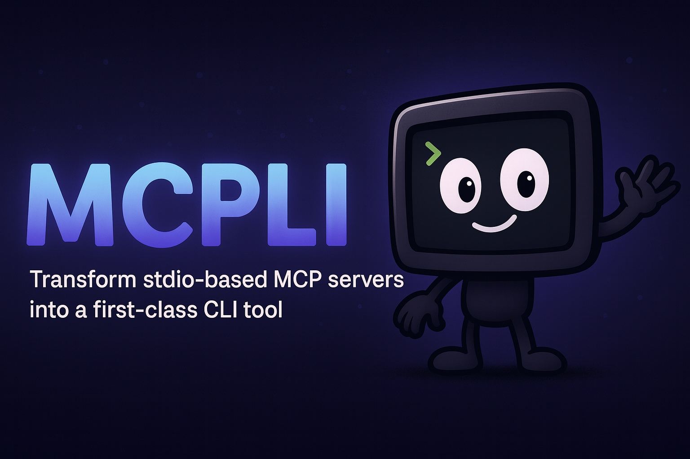

[](https://github.com/cameroncooke/mcpli/actions/workflows/ci.yml)
[](https://badge.fury.io/js/mcpli)
[](https://opensource.org/licenses/MIT)
[](https://www.apple.com/macos/)
[](https://pkg.pr.new/~/cameroncooke/mcpli)
[](https://deepwiki.com/cameroncooke/mcpli)

# MCPLI

Transform stdio-based MCP servers into a first‑class CLI tool.

MCPLI turns any stdio-based MCP server into a discoverable, script‑friendly, agent-friendly CLI. Run tools as natural commands, compose the output using standard bash tools.

## Table of contents

- [Quick Start](#quick-start)
- [Features](#features)
- [Why MCPLI?](#why-mcpli)
- [Installation](#installation)
  - [Requirements](#requirements)
  - [Global Installation](#global-installation)
  - [Direct Usage (No Installation)](#direct-usage-no-installation)
- [Usage](#usage)
  - [Discover and Run Tools](#discover-and-run-tools)
  - [Output Modes](#output-modes)
  - [Examples](#examples)
- [Advanced Features](#advanced-features)
  - [Process Management](#process-management)
    - [Multiple Daemons](#multiple-daemons)
    - [Daemon Timeouts](#daemon-timeouts)
  - [Environment Variables](#environment-variables)
  - [Debugging](#debugging)
- [Tool Parameter Syntax](#tool-parameter-syntax)
- [Contributing](#contributing)
- [Security](#security)
- [License](#license)

## Quick Start

```bash
# Install globally via npm
npm install -g mcpli

# View help
mcpli --help -- node weather-server.js

# View tool help
mcpli get-weather --help -- node weather-server.js

# Run a tool
mcpli get-weather --location "San Francisco" -- node weather-server.js
```

## Features

- Zero setup – Point at any stdio-based MCP server, get instant CLI access
- Maintains a persistent daemon to ensure MCP is stateful and same instance is reused for repeated calls
- Natural syntax – Tools become commands: `mcpli get-weather --location "NYC" -- node weather-server.js`
- Auto‑generated help – `mcpli --help -- <server>` lists tools; `mcpli <tool> --help -- <server>` shows parameters
- Clean output – Structured JSON that’s great for shell pipelines
- Flexible parameters – Supports `--key value` and `--key=value`, plus JSON for arrays/objects


## Why MCPLI?

MCP gives us a standard way for agents to talk to tools. But at scale it hits a hard limit: context and composability. Each MCP server brings tool descriptions, schemas, and metadata that the agent needs to ingest. Install a few servers with dozens of tools and you're burning tens of thousands of tokens before you've processed a single user prompt. That cost isn't just financial—it steals headroom for reasoning and hurts reliability.

This creates a false choice for developers:
- Use MCP "as intended" and accept huge, inference‑time context overhead and limited shell‑level composition.
- Abandon MCP and wrap CLI tools instead, curating concise AGENTS.md examples that are efficient, predictable, and composable—but give up MCP's standardisation.

MCPLI bridges that gap. It turns any stdio‑based MCP server into a first‑class CLI tool, so you get:
- The best of both worlds: keep your MCP servers and their capability model, but exercise them as predictable CLI commands.
- Composability by default: pipe results to jq, grep, awk, curl, or anything else your workflow demands.
- Control over context: stop auto‑injecting large tool schemas; instead provide tight, example‑driven prompts just like you would for any other CLI.
- Standard help and discoverability: mcpli auto‑generates tool help from MCP schemas, so your CLI stays self‑documenting and consistent.
- Preservation of existing investments: no server changes required—MCPLI instantly upgrades what you already have.

What changes in practice
- Your agent no longer has to ingest every tool schema up front. You feed it small, curated examples: `mcpli get-weather --location 'NYC' -- node weather-server.js`.
- You regain the shell: `mcpli get-weather ... | jq .temperature` is now trivial and reliable.
- You keep state and speed with a persistent daemon behind the scenes, but you interact through a simple, composable CLI surface.

Bottom line
MCPLI doesn't replace MCP. It completes it. Keep the standard, ditch the token bloat, and gain the composability and predictability of the command line without rewriting your servers or your workflows.

## Installation

### Requirements

- Node.js 18+
- Any MCP‑compliant server that uses stdio-based transport
- macOS (launchd) for daemon orchestration

### Global Installation
```bash
npm install -g mcpli
```

### Direct Usage (No Installation)
```bash
npx mcpli@latest <tool-command> -- <mcp-server-command> [args...]
```

## Usage

Always include the MCP server command after -- on every invocation. MCPLI does the rest for you.

### Discover and Run Tools

View tools:

```bash
mcpli --help -- <mcp-server-command> [args...]
```

View tool help:

```bash
mcpli <tool-command> --help -- <mcp-server-command> [args...]
```

Basic tool call:

```bash
npx mcpli@latest <tool-command> [tool-options...] -- <mcp-server-command> [args...]
```

### Output Modes

```bash
# Default: Friendly extraction of tool result content
mcpli get-weather --location "NYC" -- node weather-server.js

# Raw MCP response for debugging
mcpli get-weather --location "NYC" --raw -- node weather-server.js
```

### Examples

```bash
# Discover available tools from a server
> mcpli --help -- node weather-server.js

Usage:
  mcpli <tool> [tool-options...] -- <mcp-server-command> [args...]
  mcpli <tool> --help -- <mcp-server-command> [args...]
  mcpli --help -- <mcp-server-command> [args...]
  mcpli daemon <subcommand> [options]

Global Options:
  --help, -h     Show this help and list all available tools
  --verbose      Show MCP server output (stderr/logs)
  --raw          Print raw MCP response
  --debug        Enable debug output
  --timeout=<seconds> Set daemon inactivity timeout (default: 1800)

Available Tools:
  get-weather          Get current weather information for any location
  get-forecast         Get weather forecast for multiple days

Tool Help:
  mcpli <tool> --help -- <mcp-server-command>    Show detailed help for specific tool

Daemon Commands:
  daemon start   Start long-lived daemon process
  daemon stop    Stop daemon process
  daemon status  Show daemon status
  daemon restart Restart daemon process
  daemon logs    Show daemon logs
  daemon log     Show recent daemon logs (non-interactive)
  daemon clean   Clean up daemon files

Examples:
  mcpli get-weather --help -- node weather-server.js
  mcpli get-weather --option value -- node weather-server.js
```

```bash
# Get tool-specific help
> mcpli get-weather --help -- node weather-server.js

MCPLI Tool: get-weather

Description: Get current weather information for any location

Usage: mcpli get-weather [options] -- <mcp-server-command> [args...]

Options:
  --location             (string) [required] City name (e.g., "New York", "London, UK") or coordinates as "lat,lon"
  --units                (string) Temperature units (default: "fahrenheit")

Examples:
  mcpli get-weather --help -- node weather-server.js
  mcpli get-weather --location "example-value" -- node weather-server.js
```

```bash
# Run a tool
> mcpli get-weather --location "San Francisco" -- node weather-server.js

{
  "location": "San Francisco, California, United States",
  "coordinates": {
    "latitude": 37.77493,
    "longitude": -122.41942
  },
  "temperature": "63°F",
  "feels_like": "64°F",
  "humidity": "86%",
  "wind": "4 mph WSW",
  "condition": "Partly cloudy",
  "precipitation": "0\" rain",
  "timestamp": "2025-08-24T10:00"
}
```

```bash
# Compose the output
> mcpli get-weather --location "San Francisco" -- node weather-server.js | jq -r '.temperature'

63°F
```

## Advanced Features

For advanced users who want more control, you can control the behavior of MCPLI with the following commands.

### Process Management

MCPLI automatically maintains a persistent daemon to ensure your MCP server is stateful and that the same instance is reused for repeated calls.

You can manually manage the daemon with the following commands.

```bash
# Start explicitly
mcpli daemon start -- node weather-server.js

# Show status (current directory)
mcpli daemon status

# Stop a specific configuration
mcpli daemon stop -- node weather-server.js

# Stop everything in this directory
mcpli daemon stop

# Restart one or all
mcpli daemon restart -- node weather-server.js
mcpli daemon restart

# View logs (live stream)
mcpli daemon logs

# Show recent logs (non-interactive; default 2 minutes)
mcpli daemon log --since=2m
# Filter to specific daemon by passing the server command after --
mcpli daemon log --since=2m -- node weather-server.js

# Clean up files and stale sockets
mcpli daemon clean
```

#### Multiple Daemons

MCPLI creates separate daemon processes for each unique combination of command + arguments + environment variables. Each daemon gets its own identity based on a hash of these components.

```bash
# These create different daemons (different commands)
mcpli daemon start -- node weather-server.js
mcpli daemon start -- python weather.py

# These create different daemons (different args)
mcpli daemon start -- node weather-server.js --port 3000
mcpli daemon start -- node weather-server.js --port 4000

# These create different daemons (different env)
mcpli daemon start -- API_KEY=dev node weather-server.js
mcpli daemon start -- API_KEY=prod node weather-server.js
```

Each daemon exposes a Unix socket at `$TMPDIR/mcpli/<cwdHash>/<daemonId>.sock` (printed by `mcpli daemon status`):
- **Socket file**: `$TMPDIR/mcpli/<cwdHash>/<daemonId>.sock` — Unix socket for IPC communication

The hash ensures that identical configurations reuse the same daemon, while different configurations get separate processes. This allows you to run multiple MCP servers simultaneously without conflicts.

Daemon lifecycle is managed by macOS launchd — no lock files are used.

> [!NOTE]
> It's recommended to add `.mcpli/` to your `.gitignore` file to avoid committing launchd plist metadata and diagnostics. Socket files live under `$TMPDIR` and are not part of your repository.

**Shell environment does not affect daemon identity**
- Only environment variables provided after -- as KEY=VALUE tokens (CommandSpec env) are considered when computing the daemon ID.
- Setting env before mcpli runs does not create a distinct daemon.

Examples:
```bash
# Different daemons (different CommandSpec env)
mcpli daemon start -- API_KEY=dev node weather-server.js
mcpli daemon start -- API_KEY=prod node weather-server.js

# Same daemon (shell env not considered for identity)
API_KEY=dev mcpli daemon start -- node weather-server.js
mcpli daemon start -- node weather-server.js
```

#### Timeouts Overview

MCPLI uses two primary user-facing timeouts:

- Daemon inactivity timeout: how long an idle daemon stays alive.
- Tool execution timeout: how long a single MCP tool call may run.

IPC is managed automatically and will be set to at least tool timeout + 60 seconds to avoid premature disconnections.

#### Daemon Timeouts

Daemons automatically shut down after a period of inactivity to free up resources (default: 30 minutes). You can customize this timeout:

```bash
# Set a 5-minute timeout (300 seconds)
mcpli get-weather --timeout=300 --location "NYC" -- node weather-server.js

# Set a 1-hour timeout (3600 seconds) for long-running sessions
mcpli daemon start --timeout=3600 -- node weather-server.js
```

The timeout resets every time you make a request to the daemon. Once the timeout period passes without any activity, the daemon gracefully shuts down and cleans up its files.

Note on preserving timeouts:
- When you do not pass `--timeout`, MCPLI preserves the daemon's existing inactivity timeout across ensures and restarts (avoids unnecessary plist reloads).
- Passing `--timeout=<seconds>` explicitly overrides the preserved value for that daemon.

#### Tool Timeouts

Control how long a single MCP tool call may run (default: 10 minutes).

```bash
# Per-invocation: set tool timeout to 15 minutes (900 seconds)
mcpli get-weather --tool-timeout=900 --location "NYC" -- node weather-server.js

# Global default via env (milliseconds)
export MCPLI_TOOL_TIMEOUT_MS=900000
```

Notes:
- `--tool-timeout` uses seconds, matching `--timeout` for consistency.
- `MCPLI_TOOL_TIMEOUT_MS` is the env for defaults.
- IPC timeout automatically adjusts to ≥ tool timeout + 60s for tool calls.

### Environment Variables

You can set default timeouts using environment variables instead of passing `--timeout` on every command:

```bash
# Set default daemon timeout to 10 minutes (600 seconds)
export MCPLI_DEFAULT_TIMEOUT=600

# Now all commands use this timeout by default
mcpli get-weather --location "NYC" -- node weather-server.js

# You can still override with --timeout argument
mcpli get-weather --timeout=1200 --location "NYC" -- node weather-server.js
```

Available environment variables:
- `MCPLI_DEFAULT_TIMEOUT`: Daemon inactivity timeout in seconds (default: 1800)
- `MCPLI_TOOL_TIMEOUT_MS`: Default tool execution timeout in milliseconds (default: 600000)
- `MCPLI_IPC_TIMEOUT`: IPC connection timeout in milliseconds (default: 660000). For advanced tuning; generally unnecessary due to auto-buffering.
- `MCPLI_IPC_CONNECT_RETRY_BUDGET_MS`: Advanced — total time budget for retrying the initial socket connect after `orchestrator.ensure()` (default: 3000). The client automatically raises the effective budget to ~8000ms on the first connection after a launchd plist update (job `loaded`/`reloaded`) to ride out transient socket rebinds. In steady‑state, this env sets the baseline.
- `MCPLI_TIMEOUT`: Internal wrapper inactivity timeout (ms); derived from CLI `--timeout` or `MCPLI_DEFAULT_TIMEOUT` (default: 1800000). Typically not set directly.

Deprecated/unused:
- `MCPLI_CLI_TIMEOUT`: Reserved for future use; not currently enforced.

### Debugging

- `--debug` enables MCPLI diagnostics (structured, concise)
- `--verbose` shows MCP server stderr/logs
- `mcpli daemon log [--since=2m] [-- <server>]` prints recent logs without streaming
  - Default window can be configured via `MCPLI_LOG_SINCE` (e.g., `export MCPLI_LOG_SINCE=10m`)

## Tool Parameter Syntax

- Strings: `--location "San Francisco"`
- Numbers: `--count 42` or `--rating -123.456`
- Booleans: `--enabled` or `--debug false`
- Arrays: `--tags='["web","api"]'`
- Objects: `--config='{"timeout":5000}'`

Both `--key value` and `--key=value` work for all types.

## Contributing

We welcome contributions! Please see our [Contributing Guide](CONTRIBUTING.md) for details on:

- Setting up the development environment
- Understanding the codebase architecture
- Making changes and submitting pull requests
- Code quality standards and testing guidelines

Whether you're fixing bugs, adding features, improving documentation, or enhancing performance, your contributions help make MCPLI better for everyone.

## Security

For a high‑level overview of MCPLI’s security posture, see the [Security Overview](security.md).

## License

[MIT](LICENSE)
