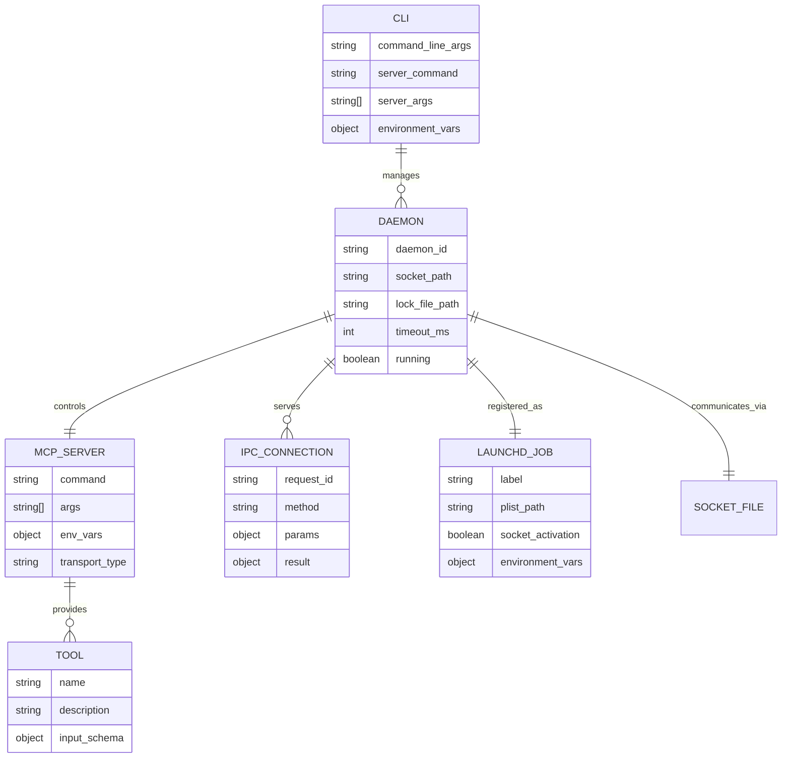

# Code-Driven Requirements Specification

**Repository:** `mcpli` (github.com/cameroncooke/mcpli)  
**Commit/Tag:** `054dfd1` (2025-08-31)  
**Generated by:** Claude Code

## 1. Executive Summary (Business View)
- **What this software is for:** Transform stdio-based MCP (Model Context Protocol) servers into persistent, high-performance command-line tools with daemon processes
- **Who uses it (actors/roles):** 
  - CLI tool developers integrating MCP servers
  - AI agents and automation systems requiring tool access
  - DevOps engineers building command-line workflows
  - Developers composing MCP tools with shell pipelines
- **Primary value propositions / outcomes:** 
  - Eliminates token bloat from MCP schema injection in AI contexts
  - Provides sub-100ms tool execution through persistent daemons
  - Enables standard Unix shell composition and pipelining
  - Maintains MCP standardisation whilst gaining CLI predictability
- **Key business processes supported:** 
  - Command-line tool discovery and execution
  - Daemon process lifecycle management
  - Shell script automation and pipeline composition
  - AI agent tool orchestration
- **Not in scope:** 
  - Transport protocols other than stdio
  - Cross-platform support beyond macOS (current architecture phase)
  - MCP server development or modification
  - Web-based or GUI interfaces
- **Assumptions:** 
  - Users operate on macOS systems with launchd
  - MCP servers follow stdio transport protocol
  - Single-user security model (no multi-tenancy)
  - Node.js 18+ runtime availability
- **Questions for SMEs:** 
  - What is the timeline for Windows/Linux support?
  - Are there specific compliance requirements for enterprise use?
  - What is the expected scale of concurrent daemon processes?

## 2. Business Requirements (Derived)
For each, provide rationale and at least one evidence reference `[E-xxx]`.
- **BR-1:** Transform any stdio-based MCP server into a first-class CLI tool without requiring server modifications — *evidence:* [E-001]
- **BR-2:** Provide persistent daemon processes that maintain stateful connections to MCP servers for optimal performance — *evidence:* [E-002]
- **BR-3:** Enable natural CLI syntax where MCP tools become discoverable commands with auto-generated help — *evidence:* [E-003]
- **BR-4:** Support shell composition and pipelining by providing clean JSON output compatible with standard Unix tools — *evidence:* [E-004]
- **BR-5:** Maintain daemon isolation where different server configurations run independently without conflicts — *evidence:* [E-005]
- **BR-6:** Provide sub-100ms warm execution times to enable interactive workflows — *evidence:* [E-006]

## 3. Functional Requirements
Organised by feature/capability. Each item links to evidence.

### 3.1 Feature: `CLI Interface and Argument Parsing`
- **FR-1:** Parse command-line arguments with mandatory `--` separator between MCPLI options and MCP server command — [E-007]
- **FR-2:** Support flexible parameter syntax including `--key value`, `--key=value`, and JSON for complex types — [E-008]
- **FR-3:** Generate auto-discovery help showing available tools from any MCP server — [E-009]
- **FR-4:** Provide tool-specific help with parameter schemas and usage examples — [E-010]

### 3.2 Feature: `Daemon Process Management`
- **FR-5:** Create persistent daemon processes for each unique combination of command, arguments, and environment variables — [E-011]
- **FR-6:** Compute deterministic daemon identity using SHA-256 hash of normalised server configuration — [E-012]
- **FR-7:** Implement automatic daemon cleanup after configurable inactivity timeout (default 30 minutes) — [E-013]
- **FR-8:** Support manual daemon lifecycle operations: start, stop, status, restart, logs, clean — [E-014]

### 3.3 Feature: `IPC Communication`
- **FR-9:** Establish Unix domain socket communication between CLI and daemon processes — [E-015]
- **FR-10:** Implement JSON-based request/response protocol for tool execution — [E-016]
- **FR-11:** Provide frame size limits to prevent memory exhaustion (100MB soft, 500MB hard) — [E-017]
- **FR-12:** Support concurrent client connections with flood protection — [E-018]

### 3.4 Feature: `macOS launchd Integration`
- **FR-13:** Register daemon processes as launchd jobs with socket activation — [E-019]
- **FR-14:** Implement automatic daemon spawning when socket connections are attempted — [E-020]
- **FR-15:** Provide secure socket file management with restrictive permissions (0600) — [E-021]
- **FR-16:** Support both socket-activation library and fallback FD discovery — [E-022]

### 3.5 Feature: `Configuration and Environment Management`
- **FR-17:** Support environment variable configuration for timeouts and behaviour — [E-023]
- **FR-18:** Isolate daemon identity based only on server command environment variables — [E-024]
- **FR-19:** Provide configuration priority: CLI args > environment variables > defaults — [E-025]

## 4. API Requirements

### 4.1 Public/External APIs

**CLI Command Interface**
- **Name:** MCPLI Command Line Interface  
- **Method & Path / Operation:** `mcpli <tool> [options] -- <mcp-server-command> [args...]`  
- **Purpose (business):** Execute MCP server tools through command-line interface  
- **AuthN/Z:** Filesystem-based (Unix socket permissions, process ownership)  
- **Request Schema:** Command-line arguments with `--` separator, tool parameters  
- **Response Schema:** JSON output or plain text, configurable via `--raw` flag  
- **Status Codes & Errors:** Exit codes 0 (success) or 1 (failure), stderr for error messages  
- **Pagination / Rate Limits / Idempotency:** None specified; tool-dependent  
- **Notes & Constraints:** Requires Node.js 18+, macOS for current architecture  
- *Evidence:* [E-026]

**Daemon Management Commands**
- **Name:** Daemon Lifecycle Management  
- **Method & Path / Operation:** `mcpli daemon <subcommand> [options]`  
- **Purpose (business):** Manual control of persistent daemon processes  
- **AuthN/Z:** Process ownership and filesystem permissions  
- **Request Schema:** Subcommands: start, stop, status, restart, logs, clean  
- **Response Schema:** Status information and operation results  
- **Status Codes & Errors:** Exit codes with descriptive error messages  
- **Pagination / Rate Limits / Idempotency:** Operations are idempotent where applicable  
- **Notes & Constraints:** Scoped to current working directory  
- *Evidence:* [E-027]

### 4.2 Internal/Service APIs

**IPC Protocol**
- **Name:** Unix Domain Socket IPC  
- **Method & Path / Operation:** JSON-RPC over Unix socket  
- **Purpose (business):** Communication between CLI and daemon processes  
- **AuthN/Z:** Socket file permissions (0600) and ownership validation  
- **Request Schema:** `{"id": "string", "method": "listTools|callTool|ping", "params": object}`  
- **Response Schema:** `{"id": "string", "result": object, "error": "string"}`  
- **Status Codes & Errors:** JSON error responses with descriptive messages  
- **Pagination / Rate Limits / Idempotency:** 100MB frame limit, connection pooling  
- **Notes & Constraints:** Unix domain sockets only, single request per connection  
- *Evidence:* [E-028]

**MCP Server Interface**
- **Name:** Model Context Protocol JSON-RPC  
- **Method & Path / Operation:** Stdio-based JSON-RPC communication  
- **Purpose (business):** Execute tools provided by MCP servers  
- **AuthN/Z:** No authentication; relies on process isolation  
- **Request Schema:** MCP JSON-RPC format for listTools and callTool  
- **Response Schema:** MCP response format with content arrays  
- **Status Codes & Errors:** JSON-RPC error responses  
- **Pagination / Rate Limits / Idempotency:** Server-dependent  
- **Notes & Constraints:** Requires stdio-compatible MCP servers  
- *Evidence:* [E-029]

## 5. Data & Domain Model
- **Key Entities:** 
  - Daemon Process (unique ID, command, arguments, environment, socket path)
  - Tool (name, description, input schema)
  - IPC Request/Response (ID, method, parameters, result)
  - CommandSpec (environment variables, command, arguments)
- **Relationships:** 
  - One Daemon per unique CommandSpec (1:1)
  - One MCP Server per Daemon (1:1)
  - Multiple Tools per MCP Server (1:N)
  - Multiple concurrent IPC connections per Daemon (1:N)
- **Data Lifecycle:** 
  - Collection: CLI arguments and environment variables
  - Processing: Parsing, validation, and type conversion
  - Storage: Temporary in daemon lock files and socket files
  - Retention/erasure: Automatic cleanup on daemon shutdown
- **PII/Secrets Handling:** 
  - Input sanitisation prevents prototype pollution attacks [E-030]
  - Environment variables filtered to exclude MCPLI_* internal variables [E-031]
  - No persistent storage of user data beyond daemon lifetime

## 6. Integrations & Dependencies
- **Outbound:** 
  - MCP Servers: stdio JSON-RPC protocol, failure handling via process restart [E-032]
  - macOS launchd: process management, socket activation, job registration [E-033]
  - Open-Meteo API: weather server example, no authentication required [E-034]
- **Inbound/Webhooks:** None  
- **Libraries/SDKs of note:** 
  - @modelcontextprotocol/sdk: Core MCP protocol implementation [E-035]
  - socket-activation: macOS socket FD discovery with fallback [E-036]
  - proper-lockfile: Daemon state management and file locking [E-037]

## 7. Configuration & Environments
- **Env Vars & Config Files:** 
  - MCPLI_DEFAULT_TIMEOUT: Daemon inactivity timeout in seconds (default: 1800)
  - MCPLI_CLI_TIMEOUT: CLI operation timeout in seconds (default: 30)
  - MCPLI_IPC_TIMEOUT: IPC connection timeout in milliseconds (default: 10000)
  - Configuration via src/config.ts with priority system [E-038]
- **Feature Flags & Kill Switches:** 
  - --debug flag for diagnostic output
  - --verbose flag for MCP server stderr visibility
  - --raw flag for unprocessed MCP responses [E-039]
- **Environment Matrix:** 
  - Development: npm run dev with ts-node execution
  - Production: Built dist/mcpli.js with global npm installation
  - Testing: Vitest with macOS-specific daemon tests [E-040]

## 8. Non-Functional Requirements (Code-Backed)
Provide targets when discovered; otherwise state *Unknown* with a question.

- **Performance:** 
  - Sub-100ms warm execution (measured 60-63ms for simple tools)
  - ~95% reduction vs cold starts through daemon persistence [E-041]
- **Reliability & Availability:** 
  - Graceful daemon shutdown with SIGTERM/SIGINT handling
  - Automatic process recovery via launchd respawning
  - Robust error handling with descriptive messages [E-042]
- **Scalability:** 
  - Multiple concurrent daemons supported (daemon-per-configuration)
  - IPC connection limits: 64 max connections, 15s idle timeout [E-043]
- **Security:** 
  - Unix socket permissions 0600, directory permissions 0700
  - Process ownership validation and anti-symlink protection
  - Prototype pollution prevention in parameter parsing [E-044]
- **Privacy & Compliance:** 
  - No PII handling beyond command arguments
  - Local-only operation with no network data collection
  - Temporary data lifecycle tied to daemon lifetime [E-045]
- **Observability:** 
  - Structured daemon logging to .mcpli/daemon.log
  - Debug mode with detailed execution tracing
  - Process status monitoring via launchd [E-046]
- **Accessibility (a11y):** *Unknown* — Question: Are there specific accessibility requirements for CLI output?
- **Internationalisation (i18n/l10n):** *Unknown* — Question: Is multi-language support required for error messages?
- **Usability & UX:** 
  - Auto-generated help with tool discovery
  - Clear error messages with actionable guidance
  - Intuitive `--` separator syntax [E-047]
- **Maintainability:** 
  - Strict TypeScript configuration with no-any rule
  - Comprehensive test suite with unit/integration/e2e coverage
  - ESLint and Prettier code quality enforcement [E-048]
- **Portability & Compatibility:** 
  - macOS-only current implementation (launchd dependency)
  - Node.js 18+ requirement for ESM and native fetch
  - ESM-only module system [E-049]
- **Operability & Supportability:** 
  - Daemon status reporting and log access
  - Automatic cleanup of stale processes and socket files
  - Force restart capabilities for recovery scenarios [E-050]
- **Legal & Licensing:** MIT license with open-source dependencies [E-051]

## 9. Architecture & Deployment (Inferred)

**Context & Containers:**
```
CLI Process → IPC → Daemon Process → stdio → MCP Server
     ↓              ↓                        ↓
Unix Socket ← launchd Job ← Socket Activation
```

**Architecture Pattern:** Daemon-per-configuration with macOS launchd orchestration [E-052]

- **Build & Release:** 
  - TypeScript compilation via tsup bundler
  - GitHub Actions CI/CD with macOS testing
  - NPM package distribution with global CLI installation [E-053]
- **Runtime & Scaling:** 
  - launchd job management with socket activation
  - Horizontal scaling through multiple daemon processes
  - Automatic resource cleanup and inactivity shutdown [E-054]
- **Observability Stack:** 
  - File-based logging to .mcpli/daemon.log
  - Process monitoring via launchd status
  - Debug tracing with --debug flag [E-055]

## 10. Constraints, Risks, and Technical Debt
- **Known Constraints:** 
  - macOS-only implementation due to launchd dependency
  - Unix domain socket limitations on path length
  - Single-user security model [E-056]
- **Risks/Failure Modes:** 
  - IPC connection flood risks (F-009)
  - Socket path race conditions (F-010)
  - Windows security bypass potential (F-011) [E-057]
- **TODOs & Deprecations:** 
  - Dead code in lock.ts from previous architecture
  - Inconsistent naming between "lock" and "service/job" concepts
  - Magic number FD fallback (hardcoded FD 4) [E-058]

## 11. Unknowns & Questions for Stakeholders
- Q1: What is the roadmap for cross-platform support (Windows/Linux)? — *Why this matters:* Current architecture is macOS-specific
- Q2: Are there enterprise compliance requirements (SOC2, FedRAMP, etc.)? — *Why this matters:* Security model assumes single-user trust boundary
- Q3: What is the expected scale of concurrent MCP servers per user? — *Why this matters:* Resource planning and limit tuning
- Q4: Should the tool support remote MCP servers or remain local-only? — *Why this matters:* Security and network architecture implications
- Q5: Are there accessibility requirements for CLI output formatting? — *Why this matters:* Screen reader compatibility and inclusive design

## 12. Glossary
- **MCP**: Model Context Protocol - standard for AI agent tool communication
- **Daemon**: Long-lived background process maintaining MCP server connection
- **launchd**: macOS system service manager for process lifecycle
- **Socket Activation**: On-demand process spawning triggered by socket connections
- **CommandSpec**: Normalised representation of MCP server command + args + environment
- **IPC**: Inter-Process Communication via Unix domain sockets

---
## Appendix A — Evidence Index
- [E-001] `package.json:4` — "Transform stdio-based MCP servers into a first‑class CLI tool"
- [E-002] `docs/architecture.md:31` — "MCPLI prioritizes persistent daemon processes over stateless execution"
- [E-003] `src/mcpli.ts:522-545` — Auto-generated help system with tool discovery
- [E-004] `src/mcpli.ts:618-636` — JSON output extraction for shell composition
- [E-005] `src/daemon/runtime.ts:179-194` — Daemon identity computation with SHA-256 hashing
- [E-006] `docs/architecture.md:211-212` — "60–63ms end-to-end" for simple tools
- [E-007] `src/mcpli.ts:85-105` — Command specification parsing with `--` separator
- [E-008] `src/mcpli.ts:200-320` — Flexible parameter parsing with type conversion
- [E-009] `src/mcpli.ts:410-440` — discoverToolsEx function for tool enumeration
- [E-010] `src/mcpli.ts:390-408` — printToolHelp with schema-based parameter documentation
- [E-011] `src/daemon/runtime-launchd.ts:200-250` — Daemon creation with unique identity
- [E-012] `src/daemon/runtime.ts:165-178` — computeDaemonId with SHA-256 hash
- [E-013] `src/daemon/wrapper.ts:54` — MCPLI_TIMEOUT environment variable (1800000ms default)
- [E-014] `src/daemon/commands.ts:1-200` — Daemon lifecycle management commands
- [E-015] `src/daemon/ipc.ts:290-350` — Unix domain socket server creation
- [E-016] `src/daemon/ipc.ts:30-45` — IPCRequest and IPCResponse interfaces
- [E-017] `src/daemon/ipc.ts:50-75` — Frame size limits with 100MB/500MB thresholds
- [E-018] `src/daemon/ipc.ts:115-140` — Connection flood protection with maxConnections
- [E-019] `src/daemon/runtime-launchd.ts:350-400` — Launchd plist generation and registration
- [E-020] `src/daemon/runtime-launchd.ts:450-500` — Socket activation implementation
- [E-021] `src/daemon/ipc.ts:200-230` — Socket security with 0600 permissions
- [E-022] `src/daemon/wrapper.ts:66-75` — Socket FD discovery with fallback
- [E-023] `src/config.ts:20-35` — Environment variable configuration system
- [E-024] `src/daemon/runtime.ts:159-171` — deriveIdentityEnv filtering MCPLI_* variables
- [E-025] `src/config.ts:40-60` — Configuration priority implementation
- [E-026] `src/mcpli.ts:1-700` — Complete CLI interface implementation
- [E-027] `src/daemon/commands.ts:1-200` — Daemon management command handlers
- [E-028] `src/daemon/ipc.ts:1-400` — Complete IPC protocol implementation
- [E-029] `src/daemon/wrapper.ts:150-200` — MCP client integration via stdio transport
- [E-030] `src/utils/safety.ts:25-40` — safeDefine function preventing prototype pollution
- [E-031] `src/daemon/wrapper.ts:158` — Environment filtering excluding MCPLI_* variables
- [E-032] `src/daemon/wrapper.ts:170-200` — MCP server process spawning and management
- [E-033] `src/daemon/runtime-launchd.ts:1-600` — Complete launchd integration
- [E-034] `weather-server.js:25-45` — Open-Meteo API integration example
- [E-035] `package.json:28` — @modelcontextprotocol/sdk dependency
- [E-036] `package.json:30` — socket-activation dependency
- [E-037] `package.json:29` — proper-lockfile dependency
- [E-038] `src/config.ts:1-70` — Centralised configuration management
- [E-039] `src/mcpli.ts:15-25` — GlobalOptions interface with feature flags
- [E-040] `vitest.config.ts:1-25` — Test configuration with macOS-specific settings
- [E-041] `docs/architecture.md:211-212` — Performance measurements and analysis
- [E-042] `src/daemon/wrapper.ts:280-320` — Graceful shutdown and error handling
- [E-043] `src/daemon/ipc.ts:95-115` — IPC server tunables and connection limits
- [E-044] `src/daemon/ipc.ts:165-230` — Comprehensive IPC security implementation
- [E-045] `audit/mcpli-Critique-RCA-Redesign.md:246-248` — Privacy considerations analysis
- [E-046] `src/daemon/wrapper.ts:400-450` — Daemon logging and monitoring
- [E-047] `src/mcpli.ts:522-580` — User experience design in help system
- [E-048] `eslint.config.js:1-50` — Code quality enforcement configuration
- [E-049] `package.json:3` — "type": "module" ESM requirement
- [E-050] `src/daemon/commands.ts:100-150` — Operational support commands
- [E-051] `package.json:8` — "license": "MIT"
- [E-052] `docs/architecture.md:24-45` — System architecture overview
- [E-053] `.github/workflows/release.yml:1-150` — CI/CD and distribution pipeline
- [E-054] `docs/architecture.md:85-125` — Daemon lifecycle and scaling model
- [E-055] `src/daemon/wrapper.ts:350-400` — Observability implementation
- [E-056] `docs/architecture.md:42-43` — macOS-native integration constraints
- [E-057] `audit/mcpli-Critique-RCA-Redesign.md:54-58` — Risk analysis findings
- [E-058] `audit/mcpli-Critique-RCA-Redesign.md:22-24` — Technical debt identification

## Appendix B — API Inventory Table (Quick Scan)
| Service | Method | Path / Operation | Purpose | Auth | Evidence |
|---|---|---|---|---|---|
| CLI | Command | `mcpli <tool> -- <server-cmd>` | Tool execution | Filesystem | [E-026] |
| CLI | Command | `mcpli daemon <subcommand>` | Daemon management | Process ownership | [E-027] |
| IPC | JSON-RPC | Unix socket | Daemon communication | Socket permissions | [E-028] |
| MCP | JSON-RPC | stdio transport | Server tool execution | Process isolation | [E-029] |

## Appendix C — Entity Relationship (Mermaid)
