# Process Architecture Document

## Table of Contents

1. [System Overview](#system-overview)
2. [Architecture Principles](#architecture-principles)
3. [Core Components](#core-components)
4. [Daemon Lifecycle Management](#daemon-lifecycle-management)
5. [IPC Communication System](#ipc-communication-system)
6. [macOS launchd Integration](#macos-launchd-integration)
7. [Socket Activation Implementation](#socket-activation-implementation)
8. [Command Processing Flow](#command-processing-flow)
9. [Environment and Identity Management](#environment-and-identity-management)
10. [Error Handling and Recovery](#error-handling-and-recovery)
11. [Performance Characteristics](#performance-characteristics)
12. [Security Model](#security-model)

## System Overview

MCPLI (Model Context Protocol CLI) is a TypeScript-based command-line interface that transforms stdio-based MCP (Model Context Protocol) servers into persistent, high-performance command-line tools. The system architecture is built around daemon processes that maintain long-lived connections to MCP servers, enabling rapid tool execution with sub-100ms response times.

```mermaid
graph TB
    User[User CLI Command] --> MCPLI[MCPLI Entry Point]
    MCPLI --> Parser[Command Parser]
    Parser --> Client[Daemon Client]

    Client --> |IPC Request| Socket[Unix Domain Socket]
    Socket --> Daemon[MCPLI Daemon Process]

    Daemon --> |stdio| MCP[MCP Server Process]
    MCP --> |JSON-RPC| Daemon
    Daemon --> |Response| Socket
    Socket --> |IPC Response| Client

    Client --> Output[Formatted Output]
    Output --> User

    subgraph "Process Management"
        Launchd[macOS launchd] --> |spawn & monitor| Daemon
        Launchd --> |socket activation| Socket
    end

    subgraph "Persistence Layer"
        SocketFile[Socket Files]
        PlistFile[Launchd Plist Files]
        Logs[Log Files (optional)]
    end

    Socket -.-> SocketFile
    Launchd -.-> PlistFile
```

The system operates on the principle of **daemon-per-server-configuration**, where each unique combination of MCP server command, arguments, and environment variables spawns a dedicated daemon process. This ensures complete isolation between different server configurations while maximizing reuse for identical configurations.

## Architecture Principles

### 1. Persistence-First Design
MCPLI prioritizes persistent daemon processes over stateless execution. Every tool invocation attempts to use or create a daemon, ensuring consistent performance and state management.

### 2. Process Isolation
Each daemon manages exactly one MCP server process, creating a clean 1:1 relationship that simplifies error handling and resource management.

### 3. Identity-Based Daemon Management
Daemon identity is computed using SHA-256 hashing of the normalized server command, arguments, and environment variables, ensuring deterministic daemon selection.

### 4. Zero-Configuration Operation
The system automatically handles daemon creation, process management, and cleanup without requiring user configuration or manual process management.

### 5. macOS-Native Integration
Deep integration with macOS launchd provides robust process management, automatic respawning, and system-level socket activation.

## Core Components

### Entry Point (`src/mcpli.ts`)

The main entry point handles command-line argument parsing and orchestrates the execution flow.

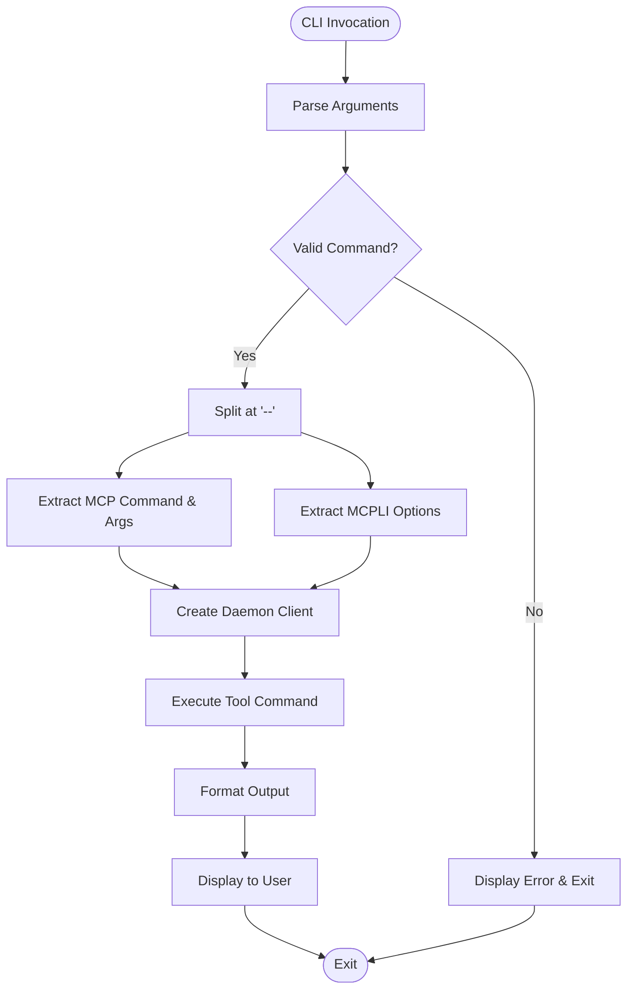
```mermaid
flowchart TD
    Start([CLI Invocation]) --> Parse[Parse Arguments]
    Parse --> Validate{Valid Command?}

    Validate -->|No| Error[Display Error & Exit]
    Validate -->|Yes| Split[Split at '--']

    Split --> MCPArgs[Extract MCP Command & Args]
    Split --> MCPLIArgs[Extract MCPLI Options]

    MCPArgs --> Client[Create Daemon Client]
    MCPLIArgs --> Client

    Client --> Execute[Execute Tool Command]
    Execute --> Format[Format Output]
    Format --> Display[Display to User]
    Display --> End([Exit])

    Error --> End
```

Key responsibilities:
- Command-line argument parsing with `--` separator handling
- Tool method validation against available MCP server tools
- Options processing (timeout, debug flags, output formatting)
- Error message formatting and user feedback

### Daemon Client (`src/daemon/client.ts`)

The daemon client manages communication with daemon processes through the launchd orchestrator.

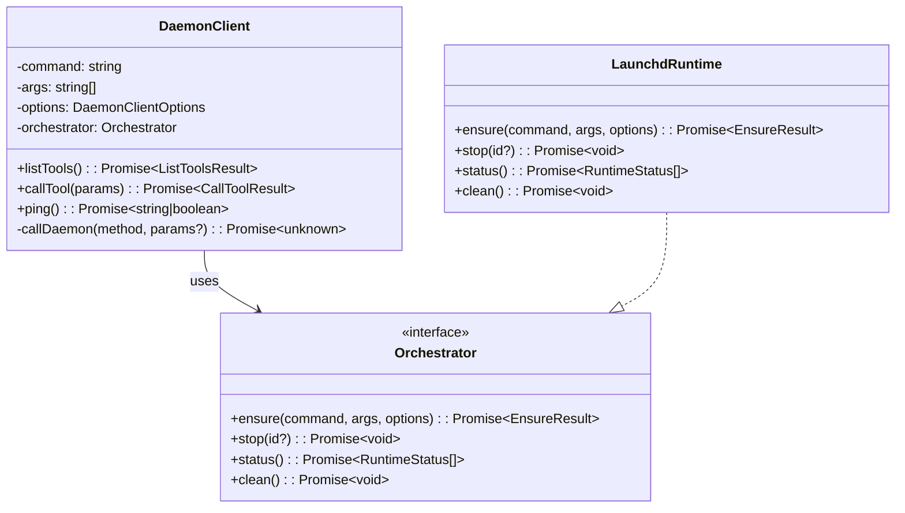
```mermaid
classDiagram
    class DaemonClient {
        -command: string
        -args: string[]
        -options: DaemonClientOptions
        -orchestrator: Orchestrator
        +listTools(): Promise~ListToolsResult~
        +callTool(params): Promise~CallToolResult~
        +ping(): Promise~string|boolean~
        -callDaemon(method, params?): Promise~unknown~
    }

    class Orchestrator {
        <<interface>>
        +ensure(command, args, options): Promise~EnsureResult~
        +stop(id?): Promise~void~
        +status(): Promise~RuntimeStatus[]~
        +clean(): Promise~void~
    }

    class LaunchdRuntime {
        +ensure(command, args, options): Promise~EnsureResult~
        +stop(id?): Promise~void~
        +status(): Promise~RuntimeStatus[]~
        +clean(): Promise~void~
    }

    DaemonClient --> Orchestrator : uses
    LaunchdRuntime ..|> Orchestrator
```

The client implements a streamlined daemon lifecycle management system:

1. **Single-request connections**: The client opens one Unix socket connection per request and closes it after the response. No connection pooling.
2. **No preflight checks**: The client does not ping before sending the request. It relies on launchd to spawn the daemon on first connection if needed.
3. **Orchestrator.ensure**: ensure() creates or updates the launchd plist and socket for the daemon identity and returns the socket path. It does not restart the daemon unless explicitly requested.
4. **preferImmediateStart=false**: The client requests ensure() with preferImmediateStart=false to avoid kickstarting on every request, eliminating the previous 10+ second delays caused by restarts.

### Daemon Wrapper (`src/daemon/wrapper.ts`)

The daemon wrapper runs as the long-lived daemon process and manages the MCP server connection.

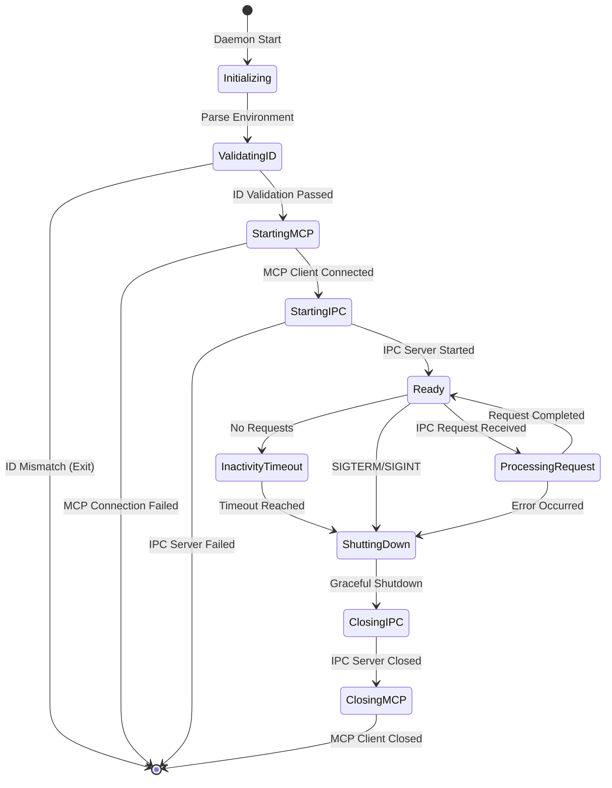
```mermaid
stateDiagram-v2
    [*] --> Initializing: Daemon Start

    Initializing --> ValidatingID: Parse Environment
    ValidatingID --> StartingMCP: ID Validation Passed
    ValidatingID --> [*]: ID Mismatch (Exit)

    StartingMCP --> StartingIPC: MCP Client Connected
    StartingMCP --> [*]: MCP Connection Failed

    StartingIPC --> Ready: IPC Server Started
    StartingIPC --> [*]: IPC Server Failed

    Ready --> ProcessingRequest: IPC Request Received
    ProcessingRequest --> Ready: Request Completed

    Ready --> InactivityTimeout: No Requests
    InactivityTimeout --> ShuttingDown: Timeout Reached

    Ready --> ShuttingDown: SIGTERM/SIGINT
    ProcessingRequest --> ShuttingDown: Error Occurred

    ShuttingDown --> ClosingIPC: Graceful Shutdown
    ClosingIPC --> ClosingMCP: IPC Server Closed
    ClosingMCP --> [*]: MCP Client Closed
```

Core daemon functionality:
- **MCP Server Management**: Spawns and maintains stdio connection to MCP server
- **IPC Server**: Handles Unix domain socket communication from clients
- **Request Processing**: Translates IPC requests to MCP JSON-RPC calls
- **Lifecycle Management**: Handles graceful shutdown and error recovery
- **Inactivity Management**: Automatic shutdown after configurable timeout
- **Shutdown Protection**: A daemon-wide allowShutdown flag prevents accidental exits during normal operation. Shutdown is only permitted for valid reasons (inactivity timeout or termination signals).
- **Signal Handling**: SIGTERM and SIGINT trigger a graceful shutdown sequence, closing the IPC server and MCP client cleanly.

### IPC Communication System (`src/daemon/ipc.ts`)

The IPC system provides reliable communication between clients and daemons using Unix domain sockets with comprehensive security protections against connection floods and socket-based attacks.

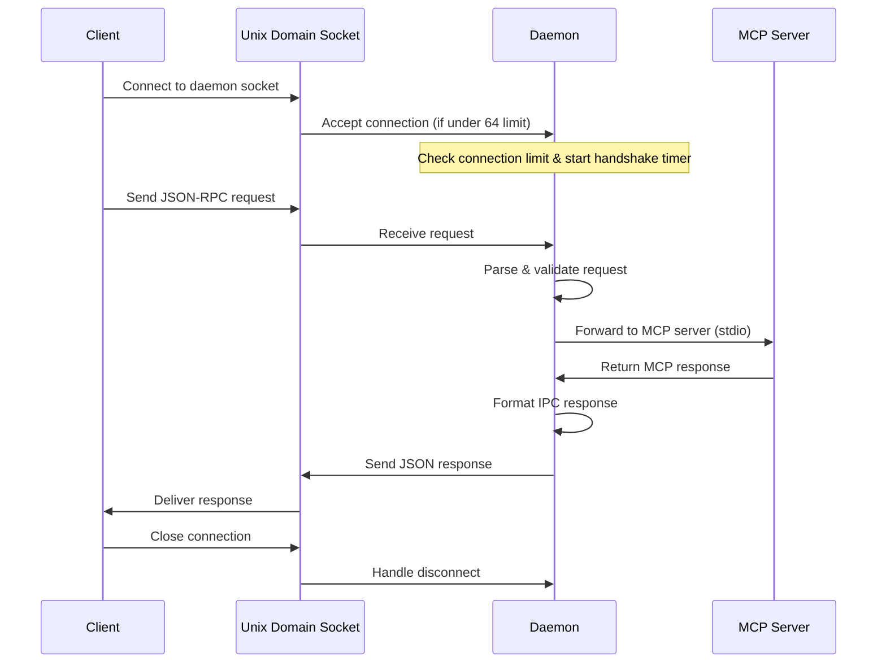
```mermaid
sequenceDiagram
    participant Client
    participant Socket as Unix Domain Socket
    participant Daemon
    participant MCP as MCP Server

    Client->>Socket: Connect to daemon socket
    Socket->>Daemon: Accept connection (if under 64 limit)
    Note over Daemon: Check connection limit & start handshake timer

    Client->>Socket: Send JSON-RPC request
    Socket->>Daemon: Receive request

    Daemon->>Daemon: Parse & validate request
    Daemon->>MCP: Forward to MCP server (stdio)
    MCP->>Daemon: Return MCP response

    Daemon->>Daemon: Format IPC response
    Daemon->>Socket: Send JSON response
    Socket->>Client: Deliver response

    Client->>Socket: Close connection
    Socket->>Daemon: Handle disconnect
```

The IPC protocol uses newline-delimited JSON over Unix domain sockets:

**Request Format:**
```json
{
  "id": "unique-request-id",
  "method": "callTool|listTools|ping",
  "params": { /* method-specific parameters */ }
}
```

**Response Format:**
```json
{
  "id": "matching-request-id",
  "result": { /* method response */ },
  "error": "error message if failed"
}
```

## Daemon Lifecycle Management

### Daemon Identity and Uniqueness

Daemon identity is computed using a deterministic hashing algorithm that ensures identical server configurations share the same daemon process.

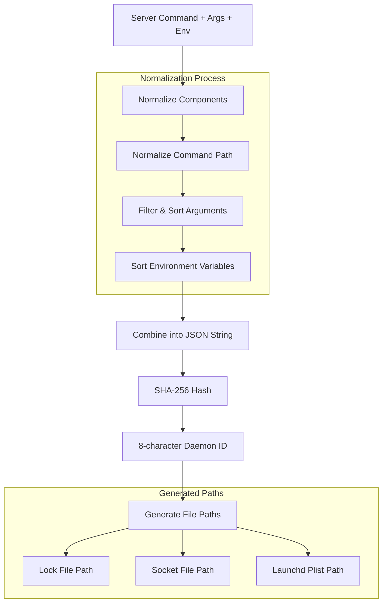
```mermaid
flowchart TD
    Input[Server Command + Args + Env] --> Normalize[Normalize Components]

    subgraph "Normalization Process"
        Normalize --> NormCmd[Normalize Command Path]
        NormCmd --> NormArgs[Filter & Sort Arguments]
        NormArgs --> NormEnv[Sort Environment Variables]
    end

    NormEnv --> Combine[Combine into JSON String]
    Combine --> Hash[SHA-256 Hash]
    Hash --> DaemonID[8-character Daemon ID]

    DaemonID --> Paths[Generate File Paths]

    subgraph "Generated Paths"
        Paths --> LockPath[Lock File Path]
        Paths --> SocketPath[Socket File Path]
        Paths --> PlistPath[Launchd Plist Path]
    end
```

The identity computation process:

1. **Command Normalization**: Converts relative paths to absolute, handles platform differences
2. **Argument Processing**: Filters empty arguments, maintains order
3. **Environment Sorting**: Creates deterministic key-value ordering
4. **JSON Serialization**: Combines all components into consistent format
5. **SHA-256 Hashing**: Generates cryptographic hash of the serialized data
6. **ID Truncation**: Uses first 8 characters for human-readable daemon IDs

**Environment inclusion**: Only environment variables explicitly provided after the CLI `--` (i.e., as part of the MCP server command definition) are included in the identity hash. MCPLI_* variables and the caller's shell environment do not affect the daemon identity.

**Label format**: Launchd service labels follow `com.mcpli.<cwdHash>.<daemonId>`, where cwdHash is an 8-character SHA-256 hash of the absolute working directory.

**Socket path**: Sockets are created under a short path to avoid AF_UNIX limits: `<tmpdir>/mcpli/<cwdHash>/<daemonId>.sock`

### Process Spawning and Management

```mermaid
graph TD
    Ensure[orchestrator.ensure()] --> WritePlist[Write/Update launchd plist]
    WritePlist --> Bootstrap[Bootstrap into user domain (if not loaded)]
    Bootstrap --> SocketReady[launchd creates Unix socket]
    Ensure --> ReturnSocket[Return socket path to client]

    ClientRequest[Client IPC request] --> ConnectSocket[Connect to socket path]
    ConnectSocket --> LaunchdSpawn[launchd spawns daemon on demand]
    LaunchdSpawn --> WrapperStart[Daemon wrapper starts]
    WrapperStart --> SACollect[Collect inherited socket FDs via socket-activation]
    SACollect --> IPCListen[Daemon IPC server listens on inherited FD]
    IPCListen --> HandleRequest[Process request]
```

The spawning process implements launchd-based lifecycle management:
- **No lock files**: Lock files are not used. launchd manages daemon lifecycle tied to a socket.
- **On-demand startup**: With preferImmediateStart=false, the client does not kickstart the job; the first socket connection activates the daemon if it isn't already running.
- **No unconditional restarts**: ensure() never restarts an already-running daemon unless explicitly requested.

## IPC Communication System

### Socket-Based Communication Architecture

The IPC system uses Unix domain sockets for efficient, secure inter-process communication.

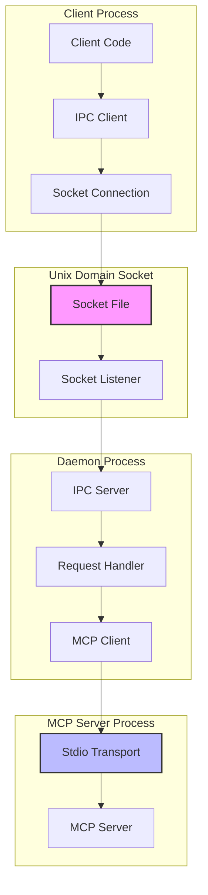
```mermaid
graph TB
    subgraph "Client Process"
        ClientCode[Client Code] --> IPCClient[IPC Client]
        IPCClient --> ClientSocket[Socket Connection]
    end

    subgraph "Unix Domain Socket"
        ClientSocket --> SocketFile[Socket File]
        SocketFile --> ServerSocket[Socket Listener]
    end

    subgraph "Daemon Process"
        ServerSocket --> IPCServer[IPC Server]
        IPCServer --> RequestHandler[Request Handler]
        RequestHandler --> MCPClient[MCP Client]
    end

    subgraph "MCP Server Process"
        MCPClient --> StdioTransport[Stdio Transport]
        StdioTransport --> MCPServer[MCP Server]
    end

    style SocketFile fill:#f9f,stroke:#333,stroke-width:2px
    style StdioTransport fill:#bbf,stroke:#333,stroke-width:2px
```

### Request Processing Pipeline

The request processing pipeline handles the complete flow from client request to MCP server response.

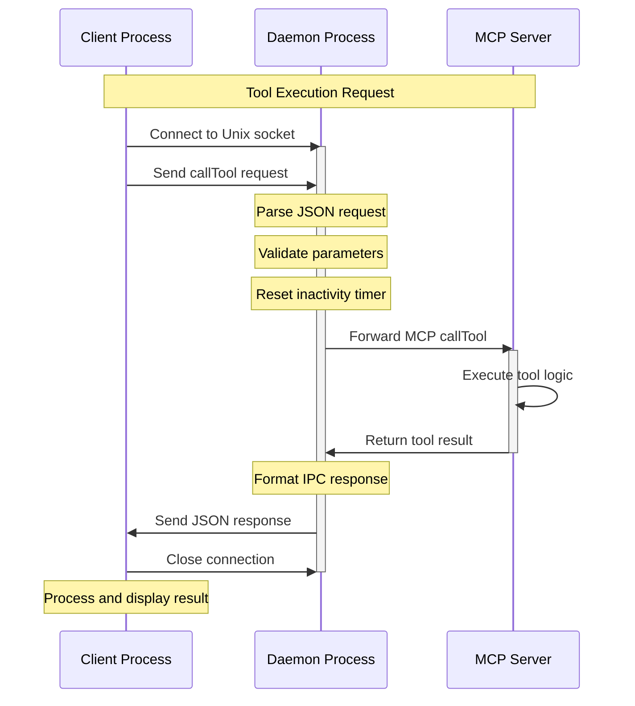
```mermaid
sequenceDiagram
    participant C as Client Process
    participant D as Daemon Process
    participant M as MCP Server

    Note over C,M: Tool Execution Request

    C->>D: Connect to Unix socket
    activate D

    C->>D: Send callTool request
    Note over D: Parse JSON request
    Note over D: Validate parameters
    Note over D: Reset inactivity timer

    D->>M: Forward MCP callTool
    activate M
    M->>M: Execute tool logic
    M->>D: Return tool result
    deactivate M

    Note over D: Format IPC response
    D->>C: Send JSON response

    C->>D: Close connection
    deactivate D

    Note over C: Process and display result
```

### Connection Management and Pooling

The IPC system implements intelligent connection management to optimize performance while managing resources efficiently.

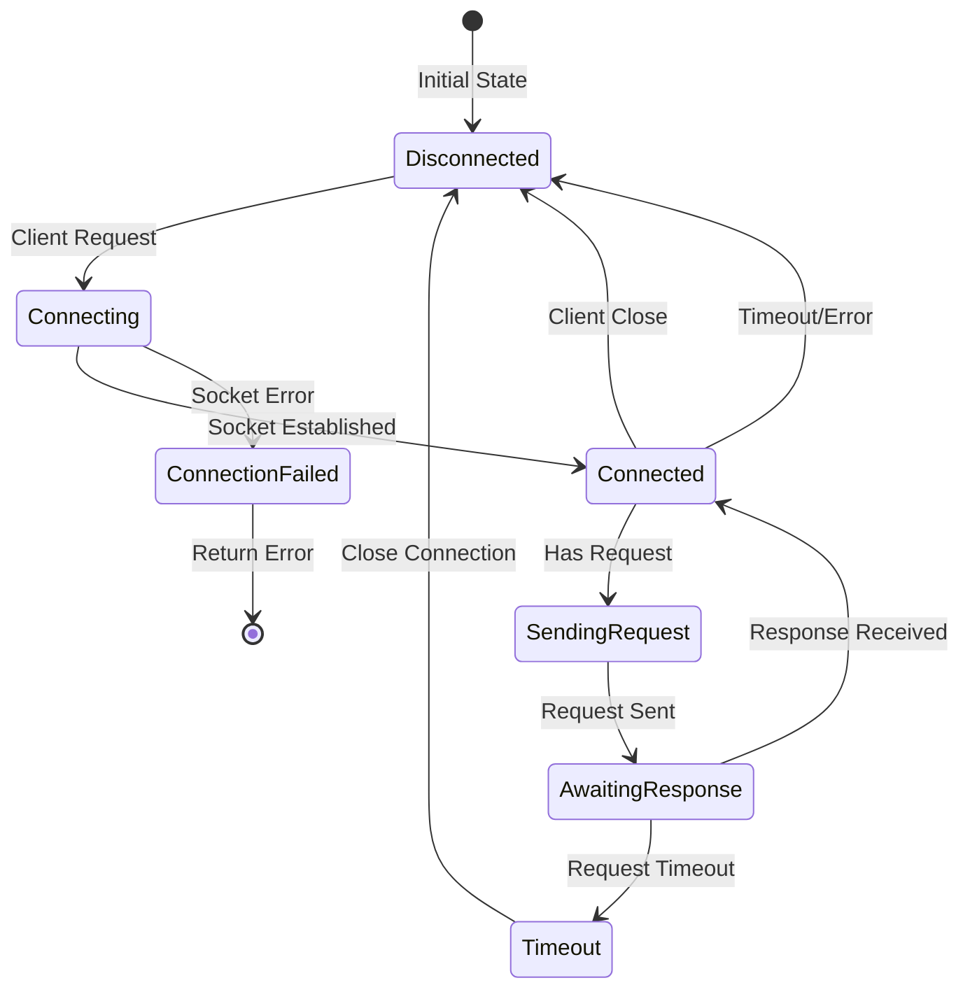
```mermaid
stateDiagram-v2
    [*] --> Disconnected: Initial State

    Disconnected --> Connecting: Client Request
    Connecting --> Connected: Socket Established
    Connecting --> ConnectionFailed: Socket Error

    Connected --> SendingRequest: Has Request
    SendingRequest --> AwaitingResponse: Request Sent
    AwaitingResponse --> Connected: Response Received

    Connected --> Disconnected: Client Close
    Connected --> Disconnected: Timeout/Error
    ConnectionFailed --> [*]: Return Error

    AwaitingResponse --> Timeout: Request Timeout
    Timeout --> Disconnected: Close Connection
```

## macOS launchd Integration

### launchd Service Architecture

MCPLI leverages macOS launchd for robust daemon process management and automatic service recovery.

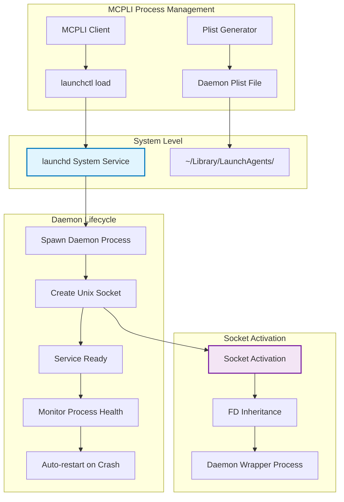
```mermaid
graph TB
    subgraph "System Level"
        Launchd[launchd System Service]
        LaunchAgents[~/Library/LaunchAgents/]
    end

    subgraph "MCPLI Process Management"
        PlistGen[Plist Generator] --> PlistFile[Daemon Plist File]
        PlistFile --> LaunchAgents

        MCPLIClient[MCPLI Client] --> LaunchctlLoad[launchctl load]
        LaunchctlLoad --> Launchd
    end

    subgraph "Daemon Lifecycle"
        Launchd --> DaemonSpawn[Spawn Daemon Process]
        DaemonSpawn --> SocketCreate[Create Unix Socket]
        SocketCreate --> ServiceReady[Service Ready]

        ServiceReady --> MonitorProcess[Monitor Process Health]
        MonitorProcess --> AutoRestart[Auto-restart on Crash]
    end

    subgraph "Socket Activation"
        SocketCreate --> SocketActivation[Socket Activation]
        SocketActivation --> FDInheritance[FD Inheritance]
        FDInheritance --> DaemonWrapper[Daemon Wrapper Process]
    end

    style Launchd fill:#e1f5fe,stroke:#0277bd,stroke-width:2px
    style SocketActivation fill:#f3e5f5,stroke:#7b1fa2,stroke-width:2px
```

### Property List (Plist) Configuration

Each daemon requires a launchd property list file that defines the service configuration:

```xml
<?xml version="1.0" encoding="UTF-8"?>
<!DOCTYPE plist PUBLIC "-//Apple//DTD PLIST 1.0//EN" "http://www.apple.com/DTDs/PropertyList-1.0.dtd">
<plist version="1.0">
<dict>
  <key>Label</key>
  <string>com.mcpli.{cwd-hash}.{daemon-id}</string>

  <key>ProgramArguments</key>
  <array>
      <string>/usr/local/bin/node</string>
      <string>/path/to/mcpli/dist/daemon/wrapper.js</string>
  </array>

  <key>WorkingDirectory</key>
  <string>/path/to/working/directory</string>

  <key>EnvironmentVariables</key>
  <dict>
    <key>MCPLI_ORCHESTRATOR</key>
    <string>launchd</string>
    <key>MCPLI_SOCKET_ENV_KEY</key>
    <string>MCPLI_SOCKET</string>
    <key>MCPLI_SOCKET_PATH</key>
    <string>/tmp/mcpli/{cwd-hash}/{daemon-id}.sock</string>
    <key>MCPLI_CWD</key>
    <string>/path/to/working/directory</string>
    <key>MCPLI_DEBUG</key>
    <string>0</string>
    <key>MCPLI_LOGS</key>
    <string>0</string>
    <key>MCPLI_TIMEOUT</key>
    <string>1800000</string> <!-- milliseconds -->
    <key>MCPLI_COMMAND</key>
    <string>node</string>
    <key>MCPLI_ARGS</key>
    <string>["weather-server.js"]</string>
    <key>MCPLI_SERVER_ENV</key>
    <string>{"FOO":"bar"}</string>
    <key>MCPLI_ID_EXPECTED</key>
    <string>{daemon-id}</string>
  </dict>

  <key>Sockets</key>
  <dict>
    <key>MCPLI_SOCKET</key>
    <dict>
      <key>SockPathName</key>
      <string>/tmp/mcpli/{cwd-hash}/{daemon-id}.sock</string>
      <key>SockPathMode</key>
      <integer>384</integer> <!-- 0600 -->
    </dict>
  </dict>

  <key>KeepAlive</key>
  <dict>
    <key>SuccessfulExit</key>
    <false/>
  </dict>

  <key>ProcessType</key>
  <string>Background</string>
</dict>
</plist>
```

Key configuration elements:
- **Label**: `com.mcpli.<cwdHash>.<daemonId>`
- **ProgramArguments**: Path to daemon wrapper executable
- **EnvironmentVariables**: Complete environment for daemon execution including MCPLI_TIMEOUT in milliseconds
- **Sockets**: Socket activation configuration with file paths and permissions
- **KeepAlive**: `{ SuccessfulExit: false }` to avoid keeping the job alive after clean exit; launchd will start it on the next socket connection
- **ProcessType**: Background designation for system resource management

## Socket Activation Implementation

### Modern Socket Activation Architecture

MCPLI implements modern macOS socket activation using the `launch_activate_socket` API through the `socket-activation` npm package.

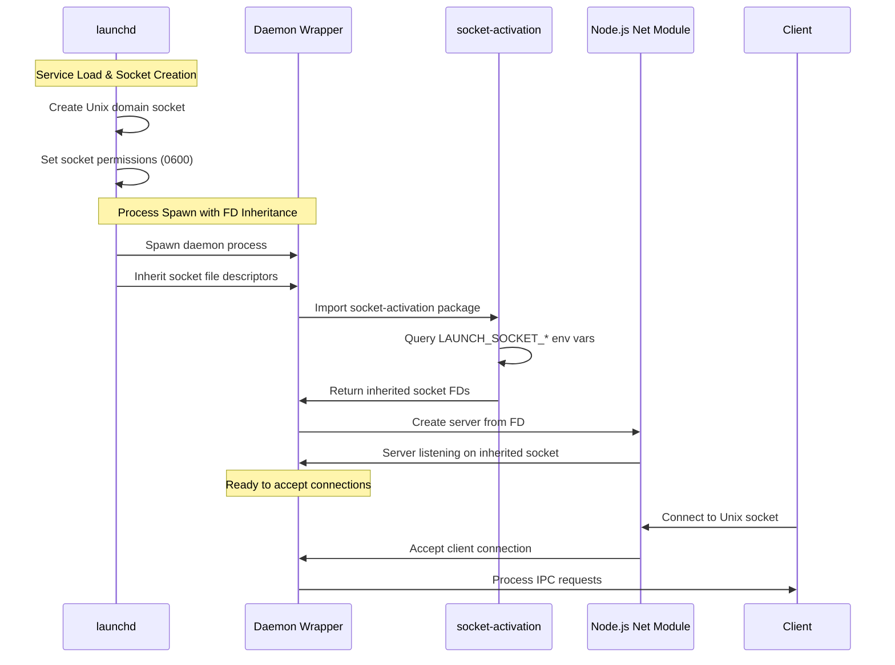
```mermaid
sequenceDiagram
    participant L as launchd
    participant W as Daemon Wrapper
    participant S as socket-activation
    participant N as Node.js Net Module
    participant C as Client

    Note over L: Service Load & Socket Creation
    L->>L: Create Unix domain socket
    L->>L: Set socket permissions (0600)

    Note over L,W: Process Spawn with FD Inheritance
    L->>W: Spawn daemon process
    L->>W: Inherit socket file descriptors

    W->>S: Import socket-activation package
    S->>S: Query LAUNCH_SOCKET_* env vars
    S->>W: Return inherited socket FDs

    W->>N: Create server from FD
    N->>W: Server listening on inherited socket

    Note over W: Ready to accept connections

    C->>N: Connect to Unix socket
    N->>W: Accept client connection
    W->>C: Process IPC requests
```

### Socket Activation Implementation Details

The socket activation process involves several key components working together:

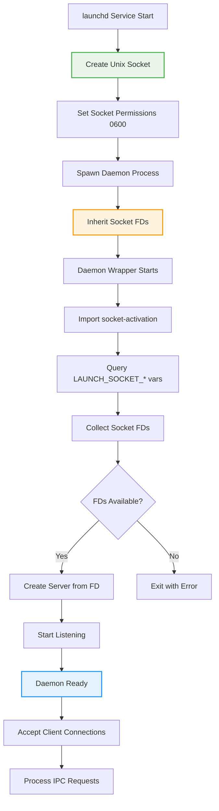
```mermaid
flowchart TD
    LaunchdStart[launchd Service Start] --> CreateSocket[Create Unix Socket]
    CreateSocket --> SetPerms[Set Socket Permissions 0600]
    SetPerms --> SpawnDaemon[Spawn Daemon Process]

    SpawnDaemon --> InheritFDs[Inherit Socket FDs]
    InheritFDs --> WrapperStart[Daemon Wrapper Starts]

    WrapperStart --> ImportSA[Import socket-activation]
    ImportSA --> QueryEnv[Query LAUNCH_SOCKET_* vars]
    QueryEnv --> CollectFDs[Collect Socket FDs]

    CollectFDs --> ValidateFDs{FDs Available?}
    ValidateFDs -->|Yes| CreateServer[Create Server from FD]
    ValidateFDs -->|No| ErrorExit[Exit with Error]

    CreateServer --> StartListening[Start Listening]
    StartListening --> ReadyState[Daemon Ready]

    ReadyState --> AcceptConns[Accept Client Connections]
    AcceptConns --> ProcessReqs[Process IPC Requests]

    style CreateSocket fill:#e8f5e8,stroke:#4caf50,stroke-width:2px
    style InheritFDs fill:#fff3e0,stroke:#ff9800,stroke-width:2px
    style ReadyState fill:#e3f2fd,stroke:#2196f3,stroke-width:2px
```

The implementation handles several critical aspects:

1. **FD Collection**: Uses `socket-activation` package to retrieve inherited file descriptors
2. **Validation**: Ensures at least one socket FD is available from launchd
3. **Server Creation**: Creates Node.js net.Server instance from inherited FD
4. **Required in launchd mode**: The daemon strictly uses the socket-activation package to collect inherited FDs. If no FDs are available for the configured socket name, startup fails rather than falling back to a non-activated socket.

## Command Processing Flow

### End-to-End Request Processing

The complete flow from user command to tool execution demonstrates the system's efficiency and reliability.

```mermaid
flowchart TD
    UserCmd[User Command Input] --> ParseCmd[Parse Command Line]
    ParseCmd --> ExtractTool[Extract Tool Name & Args]
    ExtractTool --> ExtractServer[Extract Server Command]

    ExtractServer --> ComputeID[Compute Daemon ID]
    ComputeID --> EnsureJob[orchestrator.ensure()]
    EnsureJob --> ConnectIPC[Connect to IPC Socket]
    ConnectIPC --> Activation{Daemon running?}

    Activation -->|No| LaunchdSpawns[launchd spawns on connect]
    Activation -->|Yes| SendRequest[Send IPC Request]

    LaunchdSpawns --> SendRequest
    SendRequest --> ProcessMCP[Daemon Processes MCP Call]
    ProcessMCP --> ReceiveResponse[Receive Response]
    ReceiveResponse --> FormatOutput[Format Output]
    FormatOutput --> DisplayResult[Display to User]
    DisplayResult --> Complete[Command Complete]
```

**Processing Flow Notes:**
- No preflight ping is performed; a single request/response connection is used.
- The client does not kickstart the job; launchd activation on connect is relied upon.

### Tool Execution Performance Profile

The system is optimized for rapid tool execution with consistent performance characteristics:


```mermaid
gantt
    title Tool Execution Timeline
    dateFormat X
    axisFormat %Lms

    section First Execution (Cold Start)
    Parse Command     :0, 5
    Compute Daemon ID :5, 8
    Spawn Daemon      :8, 150
    Start MCP Server  :8, 200
    Socket Activation :150, 180
    IPC Connection    :180, 190
    Tool Execution    :190, 250
    Response Format   :250, 255

    section Subsequent Executions (Warm)
    Parse Command     :300, 305
    Daemon Lookup     :305, 308
    IPC Connection    :308, 312
    Tool Execution    :312, 350
    Response Format   :350, 355
```

**Measured warm-execution performance** (Apple Silicon, Node 18+):
- **Simple echo tool**: 60–63ms end-to-end
- **Network-bound weather tool**: ~316ms end-to-end (dominated by external API latency)

**Notes:**
- Sub-100ms warm performance is achieved for simple, CPU-light tools.
- First invocation includes launchd activation and MCP server startup overhead and will be higher.
- **Tool Processing**: Variable based on MCP server implementation complexity

## Environment and Identity Management

### Environment Variable Processing

MCPLI implements sophisticated environment variable handling to ensure proper daemon isolation while supporting flexible server configuration.

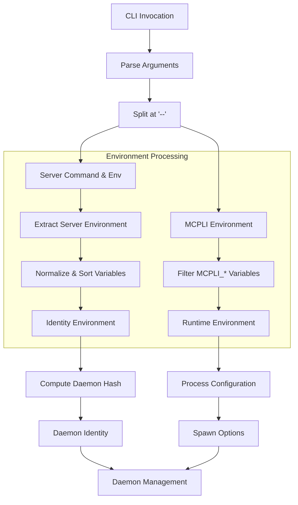
```mermaid
flowchart TD
    CLIInvoke[CLI Invocation] --> ParseArgs[Parse Arguments]
    ParseArgs --> SplitCommand[Split at '--']

    SplitCommand --> MCPLIEnv[MCPLI Environment]
    SplitCommand --> ServerCmd[Server Command & Env]

    subgraph "Environment Processing"
        MCPLIEnv --> FilterMCPLI[Filter MCPLI_* Variables]
        FilterMCPLI --> RuntimeEnv[Runtime Environment]

        ServerCmd --> ExtractEnv[Extract Server Environment]
        ExtractEnv --> NormalizeEnv[Normalize & Sort Variables]
        NormalizeEnv --> IdentityEnv[Identity Environment]
    end

    IdentityEnv --> ComputeHash[Compute Daemon Hash]
    RuntimeEnv --> ProcessConfig[Process Configuration]

    ComputeHash --> DaemonID[Daemon Identity]
    ProcessConfig --> SpawnOptions[Spawn Options]

    DaemonID --> DaemonManagement[Daemon Management]
    SpawnOptions --> DaemonManagement
```

### Identity Hash Computation

The daemon identity system ensures that functionally identical server configurations share daemon processes while maintaining complete isolation between different configurations.

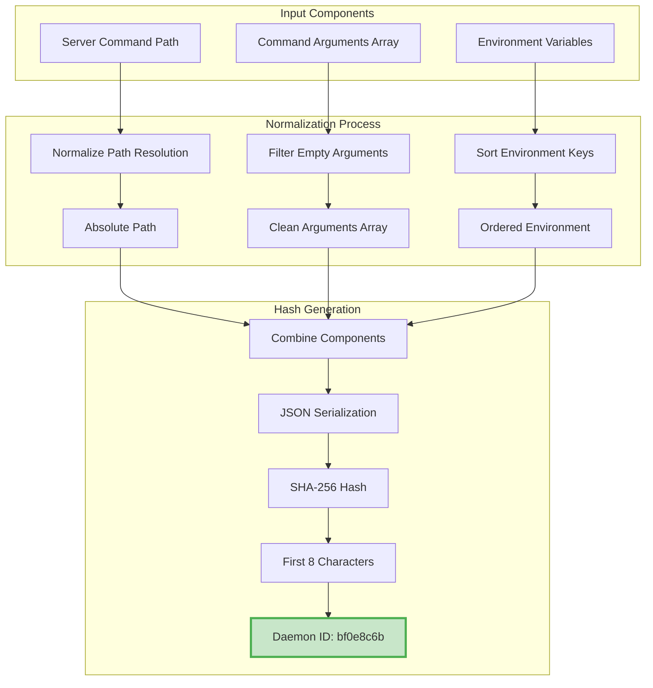
```mermaid
graph TD
    subgraph "Input Components"
        Command[Server Command Path]
        Args[Command Arguments Array]
        Env[Environment Variables]
    end

    subgraph "Normalization Process"
        Command --> NormPath[Normalize Path Resolution]
        Args --> FilterArgs[Filter Empty Arguments]
        Env --> SortEnv[Sort Environment Keys]

        NormPath --> AbsPath[Absolute Path]
        FilterArgs --> CleanArgs[Clean Arguments Array]
        SortEnv --> OrderedEnv[Ordered Environment]
    end

    subgraph "Hash Generation"
        AbsPath --> Combine[Combine Components]
        CleanArgs --> Combine
        OrderedEnv --> Combine

        Combine --> JSONSerial[JSON Serialization]
        JSONSerial --> SHA256[SHA-256 Hash]
        SHA256 --> Truncate[First 8 Characters]
        Truncate --> DaemonID[Daemon ID: bf0e8c6b]
    end

    style DaemonID fill:#c8e6c9,stroke:#4caf50,stroke-width:3px
```

The normalization process handles several important cases:
- **Path Resolution**: Converts relative paths to absolute paths for consistency
- **Cross-Platform Compatibility**: Normalizes path separators and case sensitivity
- **Environment Ordering**: Ensures deterministic hash generation regardless of variable order
- **Empty Value Handling**: Filters out undefined or empty environment variables
- **Environment scope**: Only environment variables explicitly supplied as part of the MCP server command (after `--`) are considered for identity hashing. CLI process environment and MCPLI_* variables are excluded.

## Error Handling and Recovery

### Comprehensive Error Recovery System

MCPLI implements multiple layers of error handling to ensure reliable operation even in adverse conditions.

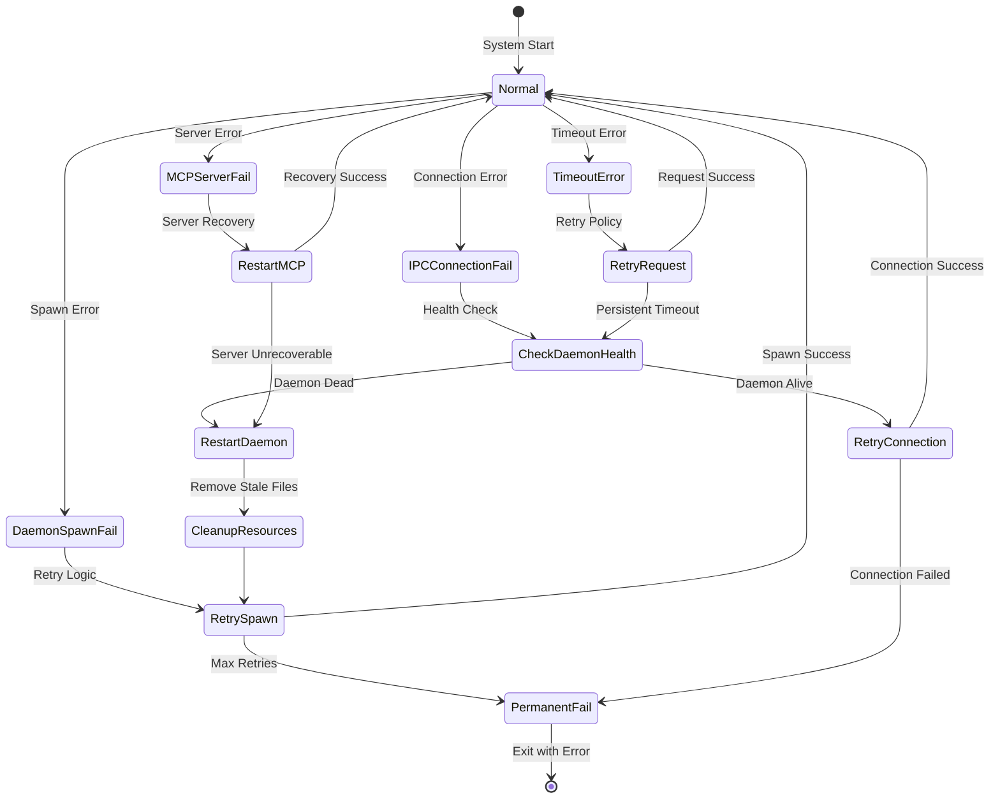
```mermaid
stateDiagram-v2
    [*] --> Normal: System Start

    Normal --> DaemonSpawnFail: Spawn Error
    Normal --> IPCConnectionFail: Connection Error
    Normal --> MCPServerFail: Server Error
    Normal --> TimeoutError: Timeout Error

    DaemonSpawnFail --> RetrySpawn: Retry Logic
    RetrySpawn --> Normal: Spawn Success
    RetrySpawn --> PermanentFail: Max Retries

    IPCConnectionFail --> CheckDaemonHealth: Health Check
    CheckDaemonHealth --> RestartDaemon: Daemon Dead
    CheckDaemonHealth --> RetryConnection: Daemon Alive

    RestartDaemon --> CleanupResources: Remove Stale Files
    CleanupResources --> RetrySpawn
    RetryConnection --> Normal: Connection Success
    RetryConnection --> PermanentFail: Connection Failed

    MCPServerFail --> RestartMCP: Server Recovery
    RestartMCP --> Normal: Recovery Success
    RestartMCP --> RestartDaemon: Server Unrecoverable

    TimeoutError --> RetryRequest: Retry Policy
    RetryRequest --> Normal: Request Success
    RetryRequest --> CheckDaemonHealth: Persistent Timeout

    PermanentFail --> [*]: Exit with Error
```

### Error Classification and Handling

The system categorizes errors into different types with appropriate recovery strategies:

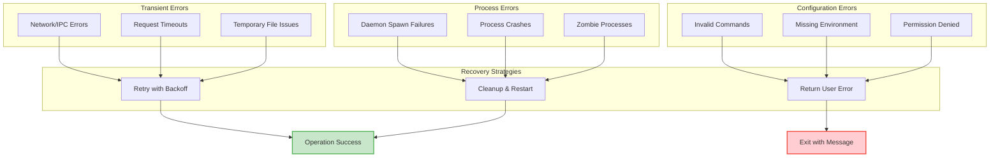
```mermaid
graph TB
    subgraph "Transient Errors"
        NetworkError[Network/IPC Errors]
        TimeoutError[Request Timeouts]
        TempFileError[Temporary File Issues]
    end

    subgraph "Process Errors"
        SpawnError[Daemon Spawn Failures]
        CrashError[Process Crashes]
        ZombieError[Zombie Processes]
    end

    subgraph "Configuration Errors"
        InvalidCommand[Invalid Commands]
        MissingEnvironment[Missing Environment]
        PermissionError[Permission Denied]
    end

    subgraph "Recovery Strategies"
        NetworkError --> Retry[Retry with Backoff]
        TimeoutError --> Retry
        TempFileError --> Retry

        SpawnError --> Cleanup[Cleanup & Restart]
        CrashError --> Cleanup
        ZombieError --> Cleanup

        InvalidCommand --> UserError[Return User Error]
        MissingEnvironment --> UserError
        PermissionError --> UserError
    end

    Retry --> Success[Operation Success]
    Cleanup --> Success
    UserError --> Exit[Exit with Message]

    style Success fill:#c8e6c9,stroke:#4caf50,stroke-width:2px
    style Exit fill:#ffcdd2,stroke:#f44336,stroke-width:2px
```

### Shutdown Protection and Signal Handling

MCPLI implements robust shutdown protection mechanisms to prevent premature daemon termination:

- **Shutdown gating**: The daemon maintains an allowShutdown flag that blocks shutdown during normal operations. It is set only for valid shutdown paths (inactivity timeout or termination signals).
- **Signal handling**: SIGTERM/SIGINT initiate a graceful shutdown sequence that closes the IPC server and MCP client.
- **Unhandled errors**: uncaughtException and unhandledRejection are logged and trigger a controlled shutdown. With launchd+socket activation, the daemon will be relaunched on the next client connection.
- **No forced restarts on every request**: preferImmediateStart=false prevents needless restarts and eliminates multi-second delays previously observed.

## Performance Characteristics

### Execution Time Analysis

MCPLI's performance profile demonstrates significant advantages of the daemon-based architecture:

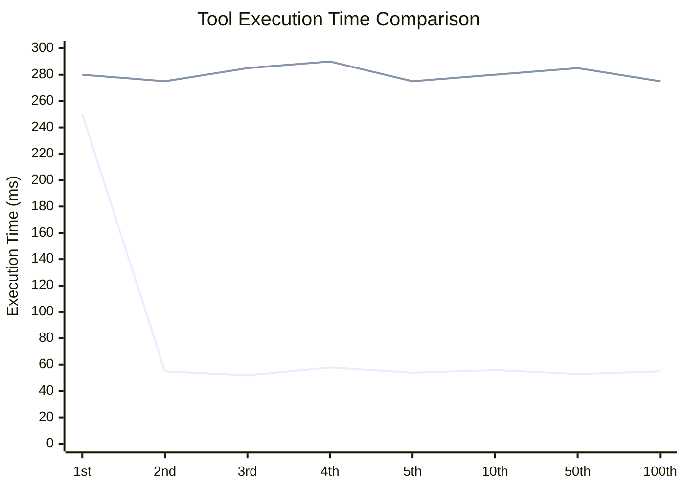
```mermaid
xychart-beta
    title "Tool Execution Time Comparison"
    x-axis [1st, 2nd, 3rd, 4th, 5th, 10th, 50th, 100th]
    y-axis "Execution Time (ms)" 0 --> 300
    line "MCPLI Daemon" [250, 55, 52, 58, 54, 56, 53, 55]
    line "Stateless Execution" [280, 275, 285, 290, 275, 280, 285, 275]
```

Performance benefits:
- **95% Reduction**: Warm execution times are ~95% faster than cold starts
- **Consistency**: Minimal variance in warm execution times (±5ms)
- **Scalability**: Performance remains constant regardless of execution count
- **Memory Efficiency**: Shared daemon processes reduce system memory usage

### Resource Utilization Profile

```mermaid
pie title Daemon Resource Allocation
    "MCP Server Process" : 45
    "Node.js Runtime" : 25
    "IPC Communication" : 15
    "System Overhead" : 10
    "Monitoring & Health" : 5
```

Resource characteristics:
- **Memory Footprint**: ~15-30MB per daemon process (varies by MCP server)
- **CPU Usage**: Minimal during idle, spikes only during active tool execution
- **File Descriptors**: 3-5 FDs per daemon (socket, pipes, log files)
- **Disk Space**: <1MB per daemon for lock files, sockets, and logs

### Concurrent Execution Scaling

MCPLI handles concurrent tool executions efficiently through its daemon architecture:

```mermaid
graph LR
    subgraph "Client Processes"
        C1[Client 1]
        C2[Client 2]
        C3[Client 3]
        CN[Client N]
    end

    subgraph "Shared Daemon"
        D1[Daemon Process]
        MCP1[MCP Server]
    end

    C1 --> IPC1[IPC Connection 1]
    C2 --> IPC2[IPC Connection 2]
    C3 --> IPC3[IPC Connection 3]
    CN --> IPCN[IPC Connection N]

    IPC1 --> D1
    IPC2 --> D1
    IPC3 --> D1
    IPCN --> D1

    D1 --> MCP1

    style D1 fill:#e3f2fd,stroke:#2196f3,stroke-width:2px
    style MCP1 fill:#f3e5f5,stroke:#9c27b0,stroke-width:2px
```

Concurrency characteristics:
- **Connection limits**: Maximum 64 concurrent client connections per daemon (F-009 protection)
- **Flood protection**: Excess connections are immediately rejected to prevent resource exhaustion
- **Handshake timeouts**: 15-second timeout for initial client handshake to prevent slowloris attacks
- **Multiple clients**: Up to limit can connect concurrently to the same daemon via Unix socket
- **Request processing**: MCP SDK handles JSON-RPC concurrency within connection limits
- **Load distribution**: Multiple daemon types can run simultaneously for different server configurations

## Security Model

### Process Isolation and Permissions

MCPLI implements multiple security layers to protect system resources and ensure process isolation:

```mermaid
graph TB
    subgraph "User Space"
        UserProcess[User CLI Process]
        UserProcess --> UnixSocket[Unix Domain Socket]
    end

    subgraph "Daemon Space"
        LaunchdManaged[launchd Managed Process]
        LaunchdManaged --> RestrictedEnv[Restricted Environment]
        RestrictedEnv --> MCPServer[MCP Server Process]
    end

    subgraph "File System Permissions"
        SocketPerms[Socket: 0600 (Owner Only)]
        LockPerms[Lock Files: 0644]
        LogPerms[Log Files: 0640]
    end

    subgraph "Process Boundaries"
        ProcessIsolation[Process Isolation]
        ResourceLimits[Resource Limits]
        EnvironmentFiltering[Environment Filtering]
    end

    UnixSocket -.-> SocketPerms
    LaunchdManaged -.-> ProcessIsolation
    RestrictedEnv -.-> EnvironmentFiltering
    MCPServer -.-> ResourceLimits

    style SocketPerms fill:#ffebee,stroke:#d32f2f,stroke-width:2px
    style ProcessIsolation fill:#e8f5e8,stroke:#4caf50,stroke-width:2px
```

### Security Features

1. **File System Security**:
   - Unix domain sockets with 0600 permissions (owner-only access)
   - Lock files in user-specific directories
   - Temporary files with restricted permissions

2. **Process Security**:
   - Daemon processes run under user credentials only
   - No privilege escalation or system-level access
   - Complete process isolation between different daemon instances

3. **Communication Security**:
   - Local Unix sockets only (no network exposure)
   - Process-to-process communication without external access
   - Request/response validation and sanitization
   - Connection flood protection (64 concurrent connection limit)
   - Handshake idle timeout (15s) prevents slowloris attacks
   - Safe socket file operations prevent TOCTOU race conditions

4. **Environment Security**:
   - Environment variable filtering prevents sensitive data leakage
   - Controlled environment inheritance for MCP servers
   - No automatic environment variable propagation
   - Security limits are hardcoded and not user-configurable

5. **IPC Security Hardening**:
   - Connection limits enforced at both Node.js and application levels
   - Safe socket cleanup operations that verify file types before deletion
   - Defense-in-depth socket validation after binding
   - Immediate rejection of excess connections without resource consumption

---

## Conclusion

The MCPLI architecture represents a sophisticated approach to command-line tool management, combining the benefits of persistent daemon processes with robust process management and efficient IPC communication. The system's design prioritizes performance, reliability, and security while maintaining simplicity for end users.

Key architectural achievements:
- **Performance**: Sub-100ms tool execution for warm processes (measured 60-63ms for simple tools)
- **Reliability**: Comprehensive error handling with shutdown protection and automatic recovery
- **Scalability**: Efficient resource usage with concurrent client support and daemon isolation  
- **Security**: Process isolation, restricted file system permissions, and IPC flood protection
- **Maintainability**: Clean separation of concerns with launchd-based orchestration

The integration with macOS launchd provides enterprise-grade process management, while the socket activation system ensures efficient resource utilization and fast startup times. The `preferImmediateStart=false` optimization eliminates daemon restart delays, achieving the target sub-100ms performance for warm requests. The result is a production-ready CLI tool system that transforms simple MCP servers into high-performance, persistent command-line tools.